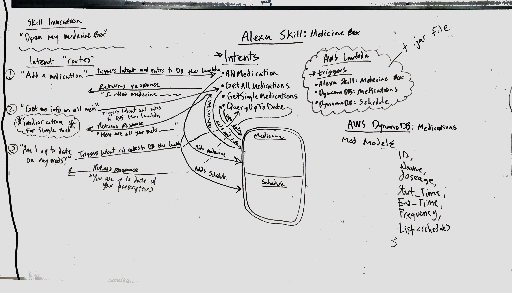

# medicine-box

## Bzing Team members:
[Micha Thorstenson](https://github.com/micahThor)
[Crystal Lee](https://github.com/crystal-leesj)
[Phong Doan](https://github.com/phongvdoan)
[Annie Pineda](https://github.com/anniepineda)

## Alexa Skill Project

Create an Alexa application capable of interacting with a user's medication. Once medicines are added to a user's Alexa device, our application will create reminders for scheduled doses, have the ability to query if the user is up-to-date with their medications, and get various details about their medicines.

Our application removes the burden and worry of taking regimented and scheduled medications. Our application will remind you when you should take which medicine and when. It also will provide feedback about your current medications, and whether you are on schedule for prescribed doses. This application is targeted at the elderly or anybody whose life is hectic and busy, and wish to be reminded about their medication instead of having to memorize their doses.

___

### Domain Model

___

### Database Entity-Relationship-Diagram

___
___
To be included...

An overview of the application and its functionality

Screenshots of the application

A link to the deployed application

A list of technologies used in the application

Directions to clone the repo and get the application running on your own computer

Include relevant comments in your code.
