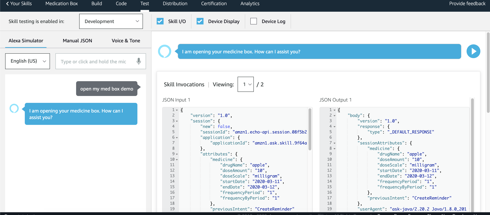
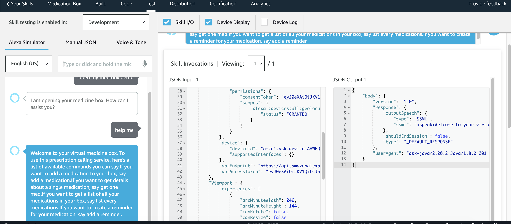

# Medicine Box
## An Alexa Skill Project

## RxIng Team members:
[Micha Thorstenson](https://github.com/micahThor)

[Crystal Lee](https://github.com/crystal-leesj)

[Phong Doan](https://github.com/phongvdoan)

[Annie Pineda](https://github.com/anniepineda)

## Alexa Skill Project

Create an Alexa application capable of interacting with a user's medication. Once medicines are added to a user's Alexa device, our application will create reminders for scheduled doses, have the ability to query if the user is up-to-date with their medications, and get various details about their medicines.

Our application removes the burden and worry of taking regimented and scheduled medications. Our application will remind you when you should take which medicine and when. It also will provide feedback about your current medications, and whether you are on schedule for prescribed doses. This application is targeted at the elderly or anybody whose life is hectic and busy, and wish to be reminded about their medication instead of having to memorize their doses.

Visit our skill repo at:  
https://github.com/crystal-leesj/medicine-box/tree/master

Invoke our skill with Alexa:

"Alexa open my med box demo"

## Technologies Used

Alexa Developer Console was used to interact with Alexa. For our backend, we used Java with Maven for our dependencies. To debug we used AWS CloudWatch to log out the errors. Since Alexa skill is a cloud-based service, tobuild this custom skill, AWS Lambda was used. It runs the code only when it's needed and scales automatically, so there is no need to provision or continuously run servers. 
   
##### List of Technologies

Alexa Skills, AWS Lambda, AWS DynamoDB, AWS CloudWatch, AWS IAM, Maven, GSON, Alexa Reminder API, JAVA, Alexa Developer Console.

___

### Skill Image As Seen In Console

___

### Wireframe

___

### Domain Model

___

### Database Entity-Relationship-Diagram

___

### Security

#### Privacy Policy:

Medicine Box an Alexa skill project allows you to save prescribed medication information on your Alexa device. 

We use your information only for use of your personal Alexa skill Medicine Box; to set medication name, dosage amount, and length of prescription. By using this Medicine Box , you agree to the collection and user of information in accordance with this policy. 

## Tests
[test](testing.md)

___

## Directions to clone the repo and get the application running on your own computer

### What you need
* [Amazon Developer Account](http://developer.amazon.com/alexa)
*  [Amazon Web Services Account](http://aws.amazon.com/)
*  Java 8 and Maven
   *  `brew install maven`
*  Clone [Medicine Box](https://github.com/crystal-leesj/medicine-box)
*  An Alexa device or emulator

### Set up the skill
1. On the Amazon Developer Console, create a skill
   1. choose Custom and Create skill
2. Add [JSON](savedJsonForAlexaSkill/openMedicine.json) to the JSON Editor and save Model then build
3. On the Permissions, enable Reminders and Location
4. On the EndPoint, choose AWS Lambda and copy the skill id.

## Set up AWS Lambda
1. create a new function within AWS Lambda
2. Add Alexa Skills kit as a trigger
   1. paste the skill id from the developer console
3. open terminal and navigate to the project root directory
   1. run `mvn org.apache.maven.plugins:maven-assembly-plugin:2.6:assembly -DdescriptorId=jar-with-dependencies package`
4. Navigate to [output](target/) and upload the jar and set the handler to `com.rxing.medicinebox.MedicineBoxStreamHandeler`
5. Copy the ARN on top and add it as the Default EndPoint in the Developer Console.
6. Set up the lambda user permissions to all DynamoDB policies

## To Run
With in the Developer Console run the skill in Test, invoking the skill using `my med box demo`

