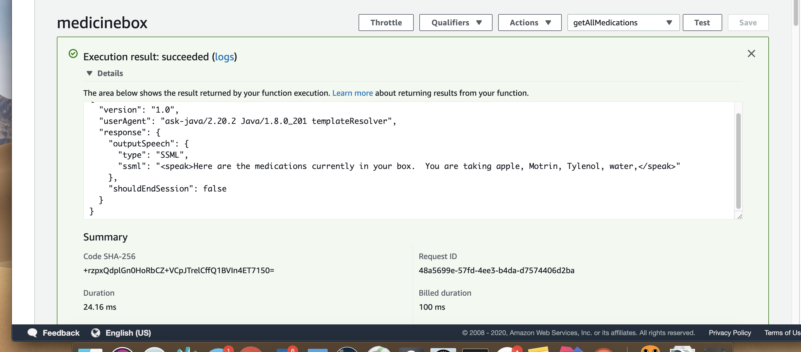
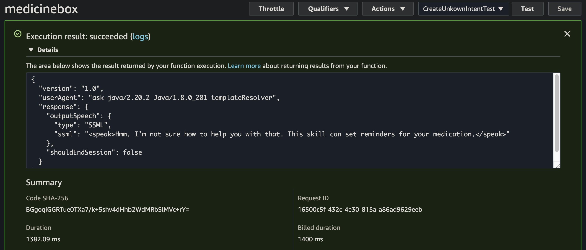

# Test the App

## Test 1 : Invoking the skill
```
{
	"version": "1.0",
	"session": {
		"new": false,
		"sessionId": "amzn1.echo-api.session.60e23bd4-c56a-4999-9e9d-e3d1c9cad747",
		"application": {
			"applicationId": "amzn1.ask.skill.9f64aeb9-c2dd-4989-8f9c-06aae7f38282"
		},
		"user": {
			"userId": "amzn1.ask.account.AHVCWP2XQ3TC3O2UEM63OHUKZ4R2RHQZE2TBEQQ7NJDN2KUQIEPOMPRWJKT33BRPJI2W4ZF3Z7LSHCCETB6ONJB4SNNDDG2TKTY4DERBCUU5LV7Y5HYDNTANAR3GAUY7ZYFFFZTME2NBCRBRQ6PFS2R4EHX4W4FV2Z3UATSXMOBH6L75PVLCSMK2OOJWIHNKU37X7NWCO3Y5H4A",
			"permissions": {
				"consentToken": "eyJ0eXAiOiJKV1QiLCJhbGciOiJSUzI1NiIsImtpZCI6IjEifQ.eyJhdWQiOiJodHRwczovL2FwaS5hbWF6b25hbGV4YS5jb20iLCJpc3MiOiJBbGV4YVNraWxsS2l0Iiwic3ViIjoiYW16bjEuYXNrLnNraWxsLjlmNjRhZWI5LWMyZGQtNDk4OS04ZjljLTA2YWFlN2YzODI4MiIsImV4cCI6MTU4NDA0MjEwNCwiaWF0IjoxNTg0MDM4NTA0LCJuYmYiOjE1ODQwMzg1MDQsInByaXZhdGVDbGFpbXMiOnsiaXNEZXByZWNhdGVkIjoidHJ1ZSIsIm5vbkx3YVNjb3BlcyI6ImFsZXhhOjpwZXJzb25faWQ6cmVhZCIsImNvbnNlbnRUb2tlbiI6IkF0emF8SXdFQklKcWxnZjgxMjlUWWFHc3dnVjBtVTNhVEhnckdBYTRuNzlTaC1OLVVuRnNxRXZfTFZxRUVLZDFDdnNPN2F4aWFuSWN5d0VKLTRDTFlnTkphcWRsRllXdEVubVc0UFFfRlJiRmxMclZWVlN2Tl94N3dBbWh2WFlqWE0zeElndEJ1bDBoaVN1TnRZX0xWM2FGbF9YM0tKRDJ6MjBhMUxTaldlWnJuMTB4RnQ1VjEzbGNVT2JncDg5cHhRWnZhNHJZWjBOTE85LVg3NDk0X2tORzR6YVBib3dpc3pHSTduSDVfMVk2WXBfcEpkcV9xLXdhZ0hIbE1nNFBUMENESjlUa2dGUWh4RWprT19zaEMxV18xcWozQzNza0NPN042VWQ5UHhPX3hQUUpiRkJPMHQxWWhkWWVzcW9EWXFXS1FHMDYxQ1BnZ21tXzhNeHhhdmNrQkhCTl8ta0xhOFcyU05BcjVYYkFPcjBncUdrdC1OUTVWb2luVEg4WElhYkpqNVJ4Wm9QQm5EQk1NaHE5aEFpcVJfaEFHTW1RQ2lJRF9lMURyQV9sZHMwRlJ4dWN0Z2ZpempsOVdCTG51M0diQmpFR2JWMEw0SDd1UjRjc3ZzZHp4bTBlc1VQSW4zSFNTRTQ0ejN2eVRZdlE5d3IxRlV0VEtRVFFZMVdqQUVucGR4N1VJekQ2STJtdnFOMUtiME9TMlJHTkJwWV94MFZuVTV6NVNKT3l5TW9KdGF6MU4tSXhVdkpuMGJDR2ZLdFg5aVQ0TVVDVk5CZjgtQ2pmRU5BejhKMGRYY0dXRy1uQUZZdUNEVVZubjQtVkM1TDBMVG5nR3p4eEJCUmlCbzNfLS1KdkhWdHhSMkNvajJOXy1kam9WcS1vQjRndWEiLCJkZXZpY2VJZCI6ImFtem4xLmFzay5kZXZpY2UuQUhXRVFGSlJVM0IzQ1JYQTNMSEVOSExVVUNYWTczUVRaUVBGQkVDTEtQVlpVS05QQ0o3SVNJRU9JNExWTE9TU0pMMk1JR1QzNFYzWFdCWkQ3NUtTMzdLRlJUREFXVTI1U1FKV1NPNTZFT0hENFJDU0RENkJRTkJNQkdZTzVWUFA0Qk83VjI3V1QyT0M3QzNJV05CUFJINUJFRkVCWDNRN05QT1BET1ZQUFJOVkVUUUxVTEU0VyIsInVzZXJJZCI6ImFtem4xLmFzay5hY2NvdW50LkFIVkNXUDJYUTNUQzNPMlVFTTYzT0hVS1o0UjJSSFFaRTJUQkVRUTdOSkROMktVUUlFUE9NUFJXSktUMzNCUlBKSTJXNFpGM1o3TFNIQ0NFVEI2T05KQjRTTk5EREcyVEtUWTRERVJCQ1VVNUxWN1k1SFlETlRBTkFSM0dBVVk3WllGRkZaVE1FMk5CQ1JCUlE2UEZTMlI0RUhYNFc0RlYyWjNVQVRTWE1PQkg2TDc1UFZMQ1NNSzJPT0pXSUhOS1UzN1g3TldDTzNZNUg0QSJ9fQ.KdPnepIoAv9Vs7xaV9QH3SiVo68NJpIB-L9HRIOpakZ7a-2Udbe1Yn4wrTe-GRsUldvR6XYrayjRcXII7H2l3Sxdp2NipsMLYNKOJ6jefDkVIniL15Xj97A4Pls17MHC6gO-2QcBYd3q-LXII2mDvq69naATqIqzlxnnwwTFkThCO0Q8AmxXH_eVTZvZ0PKzNh4NCzO_GDbJjp_jO99VJIAES14ueUhU8Rms3J4SjG1IgpkO8aALcg6Q4-gp3dpaqNBWZZdOvOfq8-O575NNeq0dlXq_79v-SRwcfCjN25SNOihHgAScVn8p3Xy_StgwPfUeQ2PZjeNQDvf4bcNVgQ",
				"scopes": {
					"alexa::devices:all:geolocation:read": {
						"status": "GRANTED"
					}
				}
			}
		}
	},
	"context": {
		"System": {
			"application": {
				"applicationId": "amzn1.ask.skill.9f64aeb9-c2dd-4989-8f9c-06aae7f38282"
			},
			"user": {
				"userId": "amzn1.ask.account.AHVCWP2XQ3TC3O2UEM63OHUKZ4R2RHQZE2TBEQQ7NJDN2KUQIEPOMPRWJKT33BRPJI2W4ZF3Z7LSHCCETB6ONJB4SNNDDG2TKTY4DERBCUU5LV7Y5HYDNTANAR3GAUY7ZYFFFZTME2NBCRBRQ6PFS2R4EHX4W4FV2Z3UATSXMOBH6L75PVLCSMK2OOJWIHNKU37X7NWCO3Y5H4A",
				"permissions": {
					"consentToken": "eyJ0eXAiOiJKV1QiLCJhbGciOiJSUzI1NiIsImtpZCI6IjEifQ.eyJhdWQiOiJodHRwczovL2FwaS5hbWF6b25hbGV4YS5jb20iLCJpc3MiOiJBbGV4YVNraWxsS2l0Iiwic3ViIjoiYW16bjEuYXNrLnNraWxsLjlmNjRhZWI5LWMyZGQtNDk4OS04ZjljLTA2YWFlN2YzODI4MiIsImV4cCI6MTU4NDA0MjEwNCwiaWF0IjoxNTg0MDM4NTA0LCJuYmYiOjE1ODQwMzg1MDQsInByaXZhdGVDbGFpbXMiOnsiaXNEZXByZWNhdGVkIjoidHJ1ZSIsIm5vbkx3YVNjb3BlcyI6ImFsZXhhOjpwZXJzb25faWQ6cmVhZCIsImNvbnNlbnRUb2tlbiI6IkF0emF8SXdFQklKcWxnZjgxMjlUWWFHc3dnVjBtVTNhVEhnckdBYTRuNzlTaC1OLVVuRnNxRXZfTFZxRUVLZDFDdnNPN2F4aWFuSWN5d0VKLTRDTFlnTkphcWRsRllXdEVubVc0UFFfRlJiRmxMclZWVlN2Tl94N3dBbWh2WFlqWE0zeElndEJ1bDBoaVN1TnRZX0xWM2FGbF9YM0tKRDJ6MjBhMUxTaldlWnJuMTB4RnQ1VjEzbGNVT2JncDg5cHhRWnZhNHJZWjBOTE85LVg3NDk0X2tORzR6YVBib3dpc3pHSTduSDVfMVk2WXBfcEpkcV9xLXdhZ0hIbE1nNFBUMENESjlUa2dGUWh4RWprT19zaEMxV18xcWozQzNza0NPN042VWQ5UHhPX3hQUUpiRkJPMHQxWWhkWWVzcW9EWXFXS1FHMDYxQ1BnZ21tXzhNeHhhdmNrQkhCTl8ta0xhOFcyU05BcjVYYkFPcjBncUdrdC1OUTVWb2luVEg4WElhYkpqNVJ4Wm9QQm5EQk1NaHE5aEFpcVJfaEFHTW1RQ2lJRF9lMURyQV9sZHMwRlJ4dWN0Z2ZpempsOVdCTG51M0diQmpFR2JWMEw0SDd1UjRjc3ZzZHp4bTBlc1VQSW4zSFNTRTQ0ejN2eVRZdlE5d3IxRlV0VEtRVFFZMVdqQUVucGR4N1VJekQ2STJtdnFOMUtiME9TMlJHTkJwWV94MFZuVTV6NVNKT3l5TW9KdGF6MU4tSXhVdkpuMGJDR2ZLdFg5aVQ0TVVDVk5CZjgtQ2pmRU5BejhKMGRYY0dXRy1uQUZZdUNEVVZubjQtVkM1TDBMVG5nR3p4eEJCUmlCbzNfLS1KdkhWdHhSMkNvajJOXy1kam9WcS1vQjRndWEiLCJkZXZpY2VJZCI6ImFtem4xLmFzay5kZXZpY2UuQUhXRVFGSlJVM0IzQ1JYQTNMSEVOSExVVUNYWTczUVRaUVBGQkVDTEtQVlpVS05QQ0o3SVNJRU9JNExWTE9TU0pMMk1JR1QzNFYzWFdCWkQ3NUtTMzdLRlJUREFXVTI1U1FKV1NPNTZFT0hENFJDU0RENkJRTkJNQkdZTzVWUFA0Qk83VjI3V1QyT0M3QzNJV05CUFJINUJFRkVCWDNRN05QT1BET1ZQUFJOVkVUUUxVTEU0VyIsInVzZXJJZCI6ImFtem4xLmFzay5hY2NvdW50LkFIVkNXUDJYUTNUQzNPMlVFTTYzT0hVS1o0UjJSSFFaRTJUQkVRUTdOSkROMktVUUlFUE9NUFJXSktUMzNCUlBKSTJXNFpGM1o3TFNIQ0NFVEI2T05KQjRTTk5EREcyVEtUWTRERVJCQ1VVNUxWN1k1SFlETlRBTkFSM0dBVVk3WllGRkZaVE1FMk5CQ1JCUlE2UEZTMlI0RUhYNFc0RlYyWjNVQVRTWE1PQkg2TDc1UFZMQ1NNSzJPT0pXSUhOS1UzN1g3TldDTzNZNUg0QSJ9fQ.KdPnepIoAv9Vs7xaV9QH3SiVo68NJpIB-L9HRIOpakZ7a-2Udbe1Yn4wrTe-GRsUldvR6XYrayjRcXII7H2l3Sxdp2NipsMLYNKOJ6jefDkVIniL15Xj97A4Pls17MHC6gO-2QcBYd3q-LXII2mDvq69naATqIqzlxnnwwTFkThCO0Q8AmxXH_eVTZvZ0PKzNh4NCzO_GDbJjp_jO99VJIAES14ueUhU8Rms3J4SjG1IgpkO8aALcg6Q4-gp3dpaqNBWZZdOvOfq8-O575NNeq0dlXq_79v-SRwcfCjN25SNOihHgAScVn8p3Xy_StgwPfUeQ2PZjeNQDvf4bcNVgQ",
					"scopes": {
						"alexa::devices:all:geolocation:read": {
							"status": "GRANTED"
						}
					}
				}
			},
			"device": {
				"deviceId": "amzn1.ask.device.AHWEQFJRU3B3CRXA3LHENHLUUCXY73QTZQPFBECLKPVZUKNPCJ7ISIEOI4LVLOSSJL2MIGT34V3XWBZD75KS37KFRTDAWU25SQJWSO56EOHD4RCSDD6BQNBMBGYO5VPP4BO7V27WT2OC7C3IWNBPRH5BEFEBX3Q7NPOPDOVPPRNVETQLULE4W",
				"supportedInterfaces": {}
			},
			"apiEndpoint": "https://api.amazonalexa.com",
			"apiAccessToken": "eyJ0eXAiOiJKV1QiLCJhbGciOiJSUzI1NiIsImtpZCI6IjEifQ.eyJhdWQiOiJodHRwczovL2FwaS5hbWF6b25hbGV4YS5jb20iLCJpc3MiOiJBbGV4YVNraWxsS2l0Iiwic3ViIjoiYW16bjEuYXNrLnNraWxsLjlmNjRhZWI5LWMyZGQtNDk4OS04ZjljLTA2YWFlN2YzODI4MiIsImV4cCI6MTU4NDAzODgwNCwiaWF0IjoxNTg0MDM4NTA0LCJuYmYiOjE1ODQwMzg1MDQsInByaXZhdGVDbGFpbXMiOnsibm9uTHdhU2NvcGVzIjoiYWxleGE6OnBlcnNvbl9pZDpyZWFkIiwiY29udGV4dCI6IkFBQUFBQUFBQUFBY0tqWGxBR2dpWlRyRWFvT250VnJCS3dFQUFBQUFBQURrQnhjWEQ2MFExMmFtby91U0pvUlQvSUpxWXFOZGp2d1o3T3prY1EwSUZBeHJSTkk0eFpKZkg1b2F1ZjcxSHJ4aVUvNWc2bFhkL0FTMktKc0o1c29PNnpsSmdlV2tCc3NXU2U0Y3ZmRDJMdFlQU25xMjVJdlRmNDlsdFgzZ1hsVGJtN0tVdFZZWDNTRi9Ub1JyZGNyMDIwbHVsbmI0V09jUVlpdUQyZWZYeCswTnNvaGd1SVdCelpIeVdDekpKK3FqVGlhYkFFaXFZbGxadEFGQVVFMmp2TTBPdFlDSlNrbDk3NGgyTmhMMWljRGt5RDhvZTFOc3lLaENEeG5URVYydWhyTTNVQU92Yjh2RHp6cGt4SjNVaXFMT1oybk1HNUIxb0c0TmdURGpTbzdmOHlzS1AyZUI1cHMwd1poSFhjNVlzbEZIb3RYVDhDWHJ3Y1VxY0lENjNvMDFXazdPdWdzemludjg5bURGRTdIc0dLQUpqNU8rOXJEdWIrVERGTmJXN3Y5ZnUzbEdvTG1Lb0E9PSIsImNvbnNlbnRUb2tlbiI6IkF0emF8SXdFQklKcWxnZjgxMjlUWWFHc3dnVjBtVTNhVEhnckdBYTRuNzlTaC1OLVVuRnNxRXZfTFZxRUVLZDFDdnNPN2F4aWFuSWN5d0VKLTRDTFlnTkphcWRsRllXdEVubVc0UFFfRlJiRmxMclZWVlN2Tl94N3dBbWh2WFlqWE0zeElndEJ1bDBoaVN1TnRZX0xWM2FGbF9YM0tKRDJ6MjBhMUxTaldlWnJuMTB4RnQ1VjEzbGNVT2JncDg5cHhRWnZhNHJZWjBOTE85LVg3NDk0X2tORzR6YVBib3dpc3pHSTduSDVfMVk2WXBfcEpkcV9xLXdhZ0hIbE1nNFBUMENESjlUa2dGUWh4RWprT19zaEMxV18xcWozQzNza0NPN042VWQ5UHhPX3hQUUpiRkJPMHQxWWhkWWVzcW9EWXFXS1FHMDYxQ1BnZ21tXzhNeHhhdmNrQkhCTl8ta0xhOFcyU05BcjVYYkFPcjBncUdrdC1OUTVWb2luVEg4WElhYkpqNVJ4Wm9QQm5EQk1NaHE5aEFpcVJfaEFHTW1RQ2lJRF9lMURyQV9sZHMwRlJ4dWN0Z2ZpempsOVdCTG51M0diQmpFR2JWMEw0SDd1UjRjc3ZzZHp4bTBlc1VQSW4zSFNTRTQ0ejN2eVRZdlE5d3IxRlV0VEtRVFFZMVdqQUVucGR4N1VJekQ2STJtdnFOMUtiME9TMlJHTkJwWV94MFZuVTV6NVNKT3l5TW9KdGF6MU4tSXhVdkpuMGJDR2ZLdFg5aVQ0TVVDVk5CZjgtQ2pmRU5BejhKMGRYY0dXRy1uQUZZdUNEVVZubjQtVkM1TDBMVG5nR3p4eEJCUmlCbzNfLS1KdkhWdHhSMkNvajJOXy1kam9WcS1vQjRndWEiLCJkZXZpY2VJZCI6ImFtem4xLmFzay5kZXZpY2UuQUhXRVFGSlJVM0IzQ1JYQTNMSEVOSExVVUNYWTczUVRaUVBGQkVDTEtQVlpVS05QQ0o3SVNJRU9JNExWTE9TU0pMMk1JR1QzNFYzWFdCWkQ3NUtTMzdLRlJUREFXVTI1U1FKV1NPNTZFT0hENFJDU0RENkJRTkJNQkdZTzVWUFA0Qk83VjI3V1QyT0M3QzNJV05CUFJINUJFRkVCWDNRN05QT1BET1ZQUFJOVkVUUUxVTEU0VyIsInVzZXJJZCI6ImFtem4xLmFzay5hY2NvdW50LkFIVkNXUDJYUTNUQzNPMlVFTTYzT0hVS1o0UjJSSFFaRTJUQkVRUTdOSkROMktVUUlFUE9NUFJXSktUMzNCUlBKSTJXNFpGM1o3TFNIQ0NFVEI2T05KQjRTTk5EREcyVEtUWTRERVJCQ1VVNUxWN1k1SFlETlRBTkFSM0dBVVk3WllGRkZaVE1FMk5CQ1JCUlE2UEZTMlI0RUhYNFc0RlYyWjNVQVRTWE1PQkg2TDc1UFZMQ1NNSzJPT0pXSUhOS1UzN1g3TldDTzNZNUg0QSJ9fQ.c7J5NLMk6UvMiKP31PfN6j5NEcU-T3L1lwm53V51o_PCkKijIYA-QnG-5pm5S03vae98V3IlPcvc-I1rOt4xEr1p4SF2lMq8ZTK7XYZkJxt0YXDorMGr7_b1HC9Wd0KE4gPLC3M-Mnalow2ubbI9fPdesWMHwGAxNX36ArciMGJgX9V-yK6GrT-D9wECApr-_YaZkOfds-L0ncYojqsU6emptWpwXofvEI-i36UJEbTLva5-aTRA-tx0yK9Puer8gPj7nMSd73Gk_IHDJmVMl9HhP9ienKMTzGvYjPLdqSz-3oZFE5PlDOOTIvCqHlNu2afNEILG1y0yVhUkY3I4eg"
		},
		"Viewport": {
			"experiences": [
				{
					"arcMinuteWidth": 246,
					"arcMinuteHeight": 144,
					"canRotate": false,
					"canResize": false
				}
			],
			"shape": "RECTANGLE",
			"pixelWidth": 1024,
			"pixelHeight": 600,
			"dpi": 160,
			"currentPixelWidth": 1024,
			"currentPixelHeight": 600,
			"touch": [
				"SINGLE"
			],
			"video": {
				"codecs": [
					"H_264_42",
					"H_264_41"
				]
			}
		},
		"Viewports": [
			{
				"type": "APL",
				"id": "main",
				"shape": "RECTANGLE",
				"dpi": 160,
				"presentationType": "STANDARD",
				"canRotate": false,
				"configuration": {
					"current": {
						"video": {
							"codecs": [
								"H_264_42",
								"H_264_41"
							]
						},
						"size": {
							"type": "DISCRETE",
							"pixelWidth": 1024,
							"pixelHeight": 600
						}
					}
				}
			}
		]
	},
	"request": {
		"type": "IntentRequest",
		"requestId": "amzn1.echo-api.request.1ba47402-b4d1-4c19-a2f5-6984cbec79dd",
		"timestamp": "2020-03-12T18:41:44Z",
		"locale": "en-US",
		"intent": {
			"name": "ListAllCommands",
			"confirmationStatus": "NONE"
		},
		"dialogState": "STARTED"
	}
}
```


## Test 2 : Help Intent
```
{
	"version": "1.0",
	"session": {
		"new": false,
		"sessionId": "amzn1.echo-api.session.60e23bd4-c56a-4999-9e9d-e3d1c9cad747",
		"application": {
			"applicationId": "amzn1.ask.skill.9f64aeb9-c2dd-4989-8f9c-06aae7f38282"
		},
		"user": {
			"userId": "amzn1.ask.account.AHVCWP2XQ3TC3O2UEM63OHUKZ4R2RHQZE2TBEQQ7NJDN2KUQIEPOMPRWJKT33BRPJI2W4ZF3Z7LSHCCETB6ONJB4SNNDDG2TKTY4DERBCUU5LV7Y5HYDNTANAR3GAUY7ZYFFFZTME2NBCRBRQ6PFS2R4EHX4W4FV2Z3UATSXMOBH6L75PVLCSMK2OOJWIHNKU37X7NWCO3Y5H4A",
			"permissions": {
				"consentToken": "eyJ0eXAiOiJKV1QiLCJhbGciOiJSUzI1NiIsImtpZCI6IjEifQ.eyJhdWQiOiJodHRwczovL2FwaS5hbWF6b25hbGV4YS5jb20iLCJpc3MiOiJBbGV4YVNraWxsS2l0Iiwic3ViIjoiYW16bjEuYXNrLnNraWxsLjlmNjRhZWI5LWMyZGQtNDk4OS04ZjljLTA2YWFlN2YzODI4MiIsImV4cCI6MTU4NDA0MjEwNCwiaWF0IjoxNTg0MDM4NTA0LCJuYmYiOjE1ODQwMzg1MDQsInByaXZhdGVDbGFpbXMiOnsiaXNEZXByZWNhdGVkIjoidHJ1ZSIsIm5vbkx3YVNjb3BlcyI6ImFsZXhhOjpwZXJzb25faWQ6cmVhZCIsImNvbnNlbnRUb2tlbiI6IkF0emF8SXdFQklKcWxnZjgxMjlUWWFHc3dnVjBtVTNhVEhnckdBYTRuNzlTaC1OLVVuRnNxRXZfTFZxRUVLZDFDdnNPN2F4aWFuSWN5d0VKLTRDTFlnTkphcWRsRllXdEVubVc0UFFfRlJiRmxMclZWVlN2Tl94N3dBbWh2WFlqWE0zeElndEJ1bDBoaVN1TnRZX0xWM2FGbF9YM0tKRDJ6MjBhMUxTaldlWnJuMTB4RnQ1VjEzbGNVT2JncDg5cHhRWnZhNHJZWjBOTE85LVg3NDk0X2tORzR6YVBib3dpc3pHSTduSDVfMVk2WXBfcEpkcV9xLXdhZ0hIbE1nNFBUMENESjlUa2dGUWh4RWprT19zaEMxV18xcWozQzNza0NPN042VWQ5UHhPX3hQUUpiRkJPMHQxWWhkWWVzcW9EWXFXS1FHMDYxQ1BnZ21tXzhNeHhhdmNrQkhCTl8ta0xhOFcyU05BcjVYYkFPcjBncUdrdC1OUTVWb2luVEg4WElhYkpqNVJ4Wm9QQm5EQk1NaHE5aEFpcVJfaEFHTW1RQ2lJRF9lMURyQV9sZHMwRlJ4dWN0Z2ZpempsOVdCTG51M0diQmpFR2JWMEw0SDd1UjRjc3ZzZHp4bTBlc1VQSW4zSFNTRTQ0ejN2eVRZdlE5d3IxRlV0VEtRVFFZMVdqQUVucGR4N1VJekQ2STJtdnFOMUtiME9TMlJHTkJwWV94MFZuVTV6NVNKT3l5TW9KdGF6MU4tSXhVdkpuMGJDR2ZLdFg5aVQ0TVVDVk5CZjgtQ2pmRU5BejhKMGRYY0dXRy1uQUZZdUNEVVZubjQtVkM1TDBMVG5nR3p4eEJCUmlCbzNfLS1KdkhWdHhSMkNvajJOXy1kam9WcS1vQjRndWEiLCJkZXZpY2VJZCI6ImFtem4xLmFzay5kZXZpY2UuQUhXRVFGSlJVM0IzQ1JYQTNMSEVOSExVVUNYWTczUVRaUVBGQkVDTEtQVlpVS05QQ0o3SVNJRU9JNExWTE9TU0pMMk1JR1QzNFYzWFdCWkQ3NUtTMzdLRlJUREFXVTI1U1FKV1NPNTZFT0hENFJDU0RENkJRTkJNQkdZTzVWUFA0Qk83VjI3V1QyT0M3QzNJV05CUFJINUJFRkVCWDNRN05QT1BET1ZQUFJOVkVUUUxVTEU0VyIsInVzZXJJZCI6ImFtem4xLmFzay5hY2NvdW50LkFIVkNXUDJYUTNUQzNPMlVFTTYzT0hVS1o0UjJSSFFaRTJUQkVRUTdOSkROMktVUUlFUE9NUFJXSktUMzNCUlBKSTJXNFpGM1o3TFNIQ0NFVEI2T05KQjRTTk5EREcyVEtUWTRERVJCQ1VVNUxWN1k1SFlETlRBTkFSM0dBVVk3WllGRkZaVE1FMk5CQ1JCUlE2UEZTMlI0RUhYNFc0RlYyWjNVQVRTWE1PQkg2TDc1UFZMQ1NNSzJPT0pXSUhOS1UzN1g3TldDTzNZNUg0QSJ9fQ.KdPnepIoAv9Vs7xaV9QH3SiVo68NJpIB-L9HRIOpakZ7a-2Udbe1Yn4wrTe-GRsUldvR6XYrayjRcXII7H2l3Sxdp2NipsMLYNKOJ6jefDkVIniL15Xj97A4Pls17MHC6gO-2QcBYd3q-LXII2mDvq69naATqIqzlxnnwwTFkThCO0Q8AmxXH_eVTZvZ0PKzNh4NCzO_GDbJjp_jO99VJIAES14ueUhU8Rms3J4SjG1IgpkO8aALcg6Q4-gp3dpaqNBWZZdOvOfq8-O575NNeq0dlXq_79v-SRwcfCjN25SNOihHgAScVn8p3Xy_StgwPfUeQ2PZjeNQDvf4bcNVgQ",
				"scopes": {
					"alexa::devices:all:geolocation:read": {
						"status": "GRANTED"
					}
				}
			}
		}
	},
	"context": {
		"System": {
			"application": {
				"applicationId": "amzn1.ask.skill.9f64aeb9-c2dd-4989-8f9c-06aae7f38282"
			},
			"user": {
				"userId": "amzn1.ask.account.AHVCWP2XQ3TC3O2UEM63OHUKZ4R2RHQZE2TBEQQ7NJDN2KUQIEPOMPRWJKT33BRPJI2W4ZF3Z7LSHCCETB6ONJB4SNNDDG2TKTY4DERBCUU5LV7Y5HYDNTANAR3GAUY7ZYFFFZTME2NBCRBRQ6PFS2R4EHX4W4FV2Z3UATSXMOBH6L75PVLCSMK2OOJWIHNKU37X7NWCO3Y5H4A",
				"permissions": {
					"consentToken": "eyJ0eXAiOiJKV1QiLCJhbGciOiJSUzI1NiIsImtpZCI6IjEifQ.eyJhdWQiOiJodHRwczovL2FwaS5hbWF6b25hbGV4YS5jb20iLCJpc3MiOiJBbGV4YVNraWxsS2l0Iiwic3ViIjoiYW16bjEuYXNrLnNraWxsLjlmNjRhZWI5LWMyZGQtNDk4OS04ZjljLTA2YWFlN2YzODI4MiIsImV4cCI6MTU4NDA0MjEwNCwiaWF0IjoxNTg0MDM4NTA0LCJuYmYiOjE1ODQwMzg1MDQsInByaXZhdGVDbGFpbXMiOnsiaXNEZXByZWNhdGVkIjoidHJ1ZSIsIm5vbkx3YVNjb3BlcyI6ImFsZXhhOjpwZXJzb25faWQ6cmVhZCIsImNvbnNlbnRUb2tlbiI6IkF0emF8SXdFQklKcWxnZjgxMjlUWWFHc3dnVjBtVTNhVEhnckdBYTRuNzlTaC1OLVVuRnNxRXZfTFZxRUVLZDFDdnNPN2F4aWFuSWN5d0VKLTRDTFlnTkphcWRsRllXdEVubVc0UFFfRlJiRmxMclZWVlN2Tl94N3dBbWh2WFlqWE0zeElndEJ1bDBoaVN1TnRZX0xWM2FGbF9YM0tKRDJ6MjBhMUxTaldlWnJuMTB4RnQ1VjEzbGNVT2JncDg5cHhRWnZhNHJZWjBOTE85LVg3NDk0X2tORzR6YVBib3dpc3pHSTduSDVfMVk2WXBfcEpkcV9xLXdhZ0hIbE1nNFBUMENESjlUa2dGUWh4RWprT19zaEMxV18xcWozQzNza0NPN042VWQ5UHhPX3hQUUpiRkJPMHQxWWhkWWVzcW9EWXFXS1FHMDYxQ1BnZ21tXzhNeHhhdmNrQkhCTl8ta0xhOFcyU05BcjVYYkFPcjBncUdrdC1OUTVWb2luVEg4WElhYkpqNVJ4Wm9QQm5EQk1NaHE5aEFpcVJfaEFHTW1RQ2lJRF9lMURyQV9sZHMwRlJ4dWN0Z2ZpempsOVdCTG51M0diQmpFR2JWMEw0SDd1UjRjc3ZzZHp4bTBlc1VQSW4zSFNTRTQ0ejN2eVRZdlE5d3IxRlV0VEtRVFFZMVdqQUVucGR4N1VJekQ2STJtdnFOMUtiME9TMlJHTkJwWV94MFZuVTV6NVNKT3l5TW9KdGF6MU4tSXhVdkpuMGJDR2ZLdFg5aVQ0TVVDVk5CZjgtQ2pmRU5BejhKMGRYY0dXRy1uQUZZdUNEVVZubjQtVkM1TDBMVG5nR3p4eEJCUmlCbzNfLS1KdkhWdHhSMkNvajJOXy1kam9WcS1vQjRndWEiLCJkZXZpY2VJZCI6ImFtem4xLmFzay5kZXZpY2UuQUhXRVFGSlJVM0IzQ1JYQTNMSEVOSExVVUNYWTczUVRaUVBGQkVDTEtQVlpVS05QQ0o3SVNJRU9JNExWTE9TU0pMMk1JR1QzNFYzWFdCWkQ3NUtTMzdLRlJUREFXVTI1U1FKV1NPNTZFT0hENFJDU0RENkJRTkJNQkdZTzVWUFA0Qk83VjI3V1QyT0M3QzNJV05CUFJINUJFRkVCWDNRN05QT1BET1ZQUFJOVkVUUUxVTEU0VyIsInVzZXJJZCI6ImFtem4xLmFzay5hY2NvdW50LkFIVkNXUDJYUTNUQzNPMlVFTTYzT0hVS1o0UjJSSFFaRTJUQkVRUTdOSkROMktVUUlFUE9NUFJXSktUMzNCUlBKSTJXNFpGM1o3TFNIQ0NFVEI2T05KQjRTTk5EREcyVEtUWTRERVJCQ1VVNUxWN1k1SFlETlRBTkFSM0dBVVk3WllGRkZaVE1FMk5CQ1JCUlE2UEZTMlI0RUhYNFc0RlYyWjNVQVRTWE1PQkg2TDc1UFZMQ1NNSzJPT0pXSUhOS1UzN1g3TldDTzNZNUg0QSJ9fQ.KdPnepIoAv9Vs7xaV9QH3SiVo68NJpIB-L9HRIOpakZ7a-2Udbe1Yn4wrTe-GRsUldvR6XYrayjRcXII7H2l3Sxdp2NipsMLYNKOJ6jefDkVIniL15Xj97A4Pls17MHC6gO-2QcBYd3q-LXII2mDvq69naATqIqzlxnnwwTFkThCO0Q8AmxXH_eVTZvZ0PKzNh4NCzO_GDbJjp_jO99VJIAES14ueUhU8Rms3J4SjG1IgpkO8aALcg6Q4-gp3dpaqNBWZZdOvOfq8-O575NNeq0dlXq_79v-SRwcfCjN25SNOihHgAScVn8p3Xy_StgwPfUeQ2PZjeNQDvf4bcNVgQ",
					"scopes": {
						"alexa::devices:all:geolocation:read": {
							"status": "GRANTED"
						}
					}
				}
			},
			"device": {
				"deviceId": "amzn1.ask.device.AHWEQFJRU3B3CRXA3LHENHLUUCXY73QTZQPFBECLKPVZUKNPCJ7ISIEOI4LVLOSSJL2MIGT34V3XWBZD75KS37KFRTDAWU25SQJWSO56EOHD4RCSDD6BQNBMBGYO5VPP4BO7V27WT2OC7C3IWNBPRH5BEFEBX3Q7NPOPDOVPPRNVETQLULE4W",
				"supportedInterfaces": {}
			},
			"apiEndpoint": "https://api.amazonalexa.com",
			"apiAccessToken": "eyJ0eXAiOiJKV1QiLCJhbGciOiJSUzI1NiIsImtpZCI6IjEifQ.eyJhdWQiOiJodHRwczovL2FwaS5hbWF6b25hbGV4YS5jb20iLCJpc3MiOiJBbGV4YVNraWxsS2l0Iiwic3ViIjoiYW16bjEuYXNrLnNraWxsLjlmNjRhZWI5LWMyZGQtNDk4OS04ZjljLTA2YWFlN2YzODI4MiIsImV4cCI6MTU4NDAzODgwNCwiaWF0IjoxNTg0MDM4NTA0LCJuYmYiOjE1ODQwMzg1MDQsInByaXZhdGVDbGFpbXMiOnsibm9uTHdhU2NvcGVzIjoiYWxleGE6OnBlcnNvbl9pZDpyZWFkIiwiY29udGV4dCI6IkFBQUFBQUFBQUFBY0tqWGxBR2dpWlRyRWFvT250VnJCS3dFQUFBQUFBQURrQnhjWEQ2MFExMmFtby91U0pvUlQvSUpxWXFOZGp2d1o3T3prY1EwSUZBeHJSTkk0eFpKZkg1b2F1ZjcxSHJ4aVUvNWc2bFhkL0FTMktKc0o1c29PNnpsSmdlV2tCc3NXU2U0Y3ZmRDJMdFlQU25xMjVJdlRmNDlsdFgzZ1hsVGJtN0tVdFZZWDNTRi9Ub1JyZGNyMDIwbHVsbmI0V09jUVlpdUQyZWZYeCswTnNvaGd1SVdCelpIeVdDekpKK3FqVGlhYkFFaXFZbGxadEFGQVVFMmp2TTBPdFlDSlNrbDk3NGgyTmhMMWljRGt5RDhvZTFOc3lLaENEeG5URVYydWhyTTNVQU92Yjh2RHp6cGt4SjNVaXFMT1oybk1HNUIxb0c0TmdURGpTbzdmOHlzS1AyZUI1cHMwd1poSFhjNVlzbEZIb3RYVDhDWHJ3Y1VxY0lENjNvMDFXazdPdWdzemludjg5bURGRTdIc0dLQUpqNU8rOXJEdWIrVERGTmJXN3Y5ZnUzbEdvTG1Lb0E9PSIsImNvbnNlbnRUb2tlbiI6IkF0emF8SXdFQklKcWxnZjgxMjlUWWFHc3dnVjBtVTNhVEhnckdBYTRuNzlTaC1OLVVuRnNxRXZfTFZxRUVLZDFDdnNPN2F4aWFuSWN5d0VKLTRDTFlnTkphcWRsRllXdEVubVc0UFFfRlJiRmxMclZWVlN2Tl94N3dBbWh2WFlqWE0zeElndEJ1bDBoaVN1TnRZX0xWM2FGbF9YM0tKRDJ6MjBhMUxTaldlWnJuMTB4RnQ1VjEzbGNVT2JncDg5cHhRWnZhNHJZWjBOTE85LVg3NDk0X2tORzR6YVBib3dpc3pHSTduSDVfMVk2WXBfcEpkcV9xLXdhZ0hIbE1nNFBUMENESjlUa2dGUWh4RWprT19zaEMxV18xcWozQzNza0NPN042VWQ5UHhPX3hQUUpiRkJPMHQxWWhkWWVzcW9EWXFXS1FHMDYxQ1BnZ21tXzhNeHhhdmNrQkhCTl8ta0xhOFcyU05BcjVYYkFPcjBncUdrdC1OUTVWb2luVEg4WElhYkpqNVJ4Wm9QQm5EQk1NaHE5aEFpcVJfaEFHTW1RQ2lJRF9lMURyQV9sZHMwRlJ4dWN0Z2ZpempsOVdCTG51M0diQmpFR2JWMEw0SDd1UjRjc3ZzZHp4bTBlc1VQSW4zSFNTRTQ0ejN2eVRZdlE5d3IxRlV0VEtRVFFZMVdqQUVucGR4N1VJekQ2STJtdnFOMUtiME9TMlJHTkJwWV94MFZuVTV6NVNKT3l5TW9KdGF6MU4tSXhVdkpuMGJDR2ZLdFg5aVQ0TVVDVk5CZjgtQ2pmRU5BejhKMGRYY0dXRy1uQUZZdUNEVVZubjQtVkM1TDBMVG5nR3p4eEJCUmlCbzNfLS1KdkhWdHhSMkNvajJOXy1kam9WcS1vQjRndWEiLCJkZXZpY2VJZCI6ImFtem4xLmFzay5kZXZpY2UuQUhXRVFGSlJVM0IzQ1JYQTNMSEVOSExVVUNYWTczUVRaUVBGQkVDTEtQVlpVS05QQ0o3SVNJRU9JNExWTE9TU0pMMk1JR1QzNFYzWFdCWkQ3NUtTMzdLRlJUREFXVTI1U1FKV1NPNTZFT0hENFJDU0RENkJRTkJNQkdZTzVWUFA0Qk83VjI3V1QyT0M3QzNJV05CUFJINUJFRkVCWDNRN05QT1BET1ZQUFJOVkVUUUxVTEU0VyIsInVzZXJJZCI6ImFtem4xLmFzay5hY2NvdW50LkFIVkNXUDJYUTNUQzNPMlVFTTYzT0hVS1o0UjJSSFFaRTJUQkVRUTdOSkROMktVUUlFUE9NUFJXSktUMzNCUlBKSTJXNFpGM1o3TFNIQ0NFVEI2T05KQjRTTk5EREcyVEtUWTRERVJCQ1VVNUxWN1k1SFlETlRBTkFSM0dBVVk3WllGRkZaVE1FMk5CQ1JCUlE2UEZTMlI0RUhYNFc0RlYyWjNVQVRTWE1PQkg2TDc1UFZMQ1NNSzJPT0pXSUhOS1UzN1g3TldDTzNZNUg0QSJ9fQ.c7J5NLMk6UvMiKP31PfN6j5NEcU-T3L1lwm53V51o_PCkKijIYA-QnG-5pm5S03vae98V3IlPcvc-I1rOt4xEr1p4SF2lMq8ZTK7XYZkJxt0YXDorMGr7_b1HC9Wd0KE4gPLC3M-Mnalow2ubbI9fPdesWMHwGAxNX36ArciMGJgX9V-yK6GrT-D9wECApr-_YaZkOfds-L0ncYojqsU6emptWpwXofvEI-i36UJEbTLva5-aTRA-tx0yK9Puer8gPj7nMSd73Gk_IHDJmVMl9HhP9ienKMTzGvYjPLdqSz-3oZFE5PlDOOTIvCqHlNu2afNEILG1y0yVhUkY3I4eg"
		},
		"Viewport": {
			"experiences": [
				{
					"arcMinuteWidth": 246,
					"arcMinuteHeight": 144,
					"canRotate": false,
					"canResize": false
				}
			],
			"shape": "RECTANGLE",
			"pixelWidth": 1024,
			"pixelHeight": 600,
			"dpi": 160,
			"currentPixelWidth": 1024,
			"currentPixelHeight": 600,
			"touch": [
				"SINGLE"
			],
			"video": {
				"codecs": [
					"H_264_42",
					"H_264_41"
				]
			}
		},
		"Viewports": [
			{
				"type": "APL",
				"id": "main",
				"shape": "RECTANGLE",
				"dpi": 160,
				"presentationType": "STANDARD",
				"canRotate": false,
				"configuration": {
					"current": {
						"video": {
							"codecs": [
								"H_264_42",
								"H_264_41"
							]
						},
						"size": {
							"type": "DISCRETE",
							"pixelWidth": 1024,
							"pixelHeight": 600
						}
					}
				}
			}
		]
	},
	"request": {
		"type": "IntentRequest",
		"requestId": "amzn1.echo-api.request.1ba47402-b4d1-4c19-a2f5-6984cbec79dd",
		"timestamp": "2020-03-12T18:41:44Z",
		"locale": "en-US",
		"intent": {
			"name": "ListAllCommands",
			"confirmationStatus": "NONE"
		},
		"dialogState": "STARTED"
	}
}
```


## Test 3 : Add Medication Intent
```
{
	"version": "1.0",
	"session": {
		"new": false,
		"sessionId": "amzn1.echo-api.session.28faaa47-5be5-4f9d-81a9-febf7cc654e7",
		"application": {
			"applicationId": "amzn1.ask.skill.9f64aeb9-c2dd-4989-8f9c-06aae7f38282"
		},
		"user": {
			"userId": "amzn1.ask.account.AHVCWP2XQ3TC3O2UEM63OHUKZ4R2RHQZE2TBEQQ7NJDN2KUQIEPOMPRWJKT33BRPJI2W4ZF3Z7LSHCCETB6ONJB4SNNDDG2TKTY4DERBCUU5LV7Y5HYDNTANAR3GAUY7ZYFFFZTME2NBCRBRQ6PFS2R4EHX4W4FV2Z3UATSXMOBH6L75PVLCSMK2OOJWIHNKU37X7NWCO3Y5H4A",
			"permissions": {
				"consentToken": "eyJ0eXAiOiJKV1QiLCJhbGciOiJSUzI1NiIsImtpZCI6IjEifQ.eyJhdWQiOiJodHRwczovL2FwaS5hbWF6b25hbGV4YS5jb20iLCJpc3MiOiJBbGV4YVNraWxsS2l0Iiwic3ViIjoiYW16bjEuYXNrLnNraWxsLjlmNjRhZWI5LWMyZGQtNDk4OS04ZjljLTA2YWFlN2YzODI4MiIsImV4cCI6MTU4NDA0Mzc3NCwiaWF0IjoxNTg0MDQwMTc0LCJuYmYiOjE1ODQwNDAxNzQsInByaXZhdGVDbGFpbXMiOnsiaXNEZXByZWNhdGVkIjoidHJ1ZSIsIm5vbkx3YVNjb3BlcyI6ImFsZXhhOjpwZXJzb25faWQ6cmVhZCIsImNvbnNlbnRUb2tlbiI6IkF0emF8SXdFQklKcWxnZjgxMjlUWWFHc3dnVjBtVTNhVEhnckdBYTRuNzlTaC1OLVVuRnNxRXZfTFZxRUVLZDFDdnNPN2F4aWFuSWN5d0VKLTRDTFlnTkphcWRsRllXdEVubVc0UFFfRlJiRmxMclZWVlN2Tl94N3dBbWh2WFlqWE0zeElndEJ1bDBoaVN1TnRZX0xWM2FGbF9YM0tKRDJ6MjBhMUxTaldlWnJuMTB4RnQ1VjEzbGNVT2JncDg5cHhRWnZhNHJZWjBOTE85LVg3NDk0X2tORzR6YVBib3dpc3pHSTduSDVfMVk2WXBfcEpkcV9xLXdhZ0hIbE1nNFBUMENESjlUa2dGUWh4RWprT19zaEMxV18xcWozQzNza0NPN042VWQ5UHhPX3hQUUpiRkJPMHQxWWhkWWVzcW9EWXFXS1FHMDYxQ1BnZ21tXzhNeHhhdmNrQkhCTl8ta0xhOFcyU05BcjVYYkFPcjBncUdrdC1OUTVWb2luVEg4WElhYkpqNVJ4Wm9QQm5EQk1NaHE5aEFpcVJfaEFHTW1RQ2lJRF9lMURyQV9sZHMwRlJ4dWN0Z2ZpempsOVdCTG51M0diQmpFR2JWMEw0SDd1UjRjc3ZzZHp4bTBlc1VQSW4zSFNTRTQ0ejN2eVRZdlE5d3IxRlV0VEtRVFFZMVdqQUVucGR4N1VJekQ2STJtdnFOMUtiME9TMlJHTkJwWV94MFZuVTV6NVNKT3l5TW9KdGF6MU4tSXhVdkpuMGJDR2ZLdFg5aVQ0TVVDVk5CZjgtQ2pmRU5BejhKMGRYY0dXRy1uQUZZdUNEVVZubjQtVkM1TDBMVG5nR3p4eEJCUmlCbzNfLS1KdkhWdHhSMkNvajJOXy1kam9WcS1vQjRndWEiLCJkZXZpY2VJZCI6ImFtem4xLmFzay5kZXZpY2UuQUhXRVFGSlJVM0IzQ1JYQTNMSEVOSExVVUNYWTczUVRaUVBGQkVDTEtQVlpVS05QQ0o3SVNJRU9JNExWTE9TU0pMMk1JR1QzNFYzWFdCWkQ3NUtTMzdLRlJUREFXVTI1U1FKV1NPNTZFT0hENFJDU0RENkJRTkJNQkdZTzVWUFA0Qk83VjI3V1QyT0M3QzNJV05CUFJINUJFRkVCWDNRN05QT1BET1ZQUFJOVkVUUUxVTEU0VyIsInVzZXJJZCI6ImFtem4xLmFzay5hY2NvdW50LkFIVkNXUDJYUTNUQzNPMlVFTTYzT0hVS1o0UjJSSFFaRTJUQkVRUTdOSkROMktVUUlFUE9NUFJXSktUMzNCUlBKSTJXNFpGM1o3TFNIQ0NFVEI2T05KQjRTTk5EREcyVEtUWTRERVJCQ1VVNUxWN1k1SFlETlRBTkFSM0dBVVk3WllGRkZaVE1FMk5CQ1JCUlE2UEZTMlI0RUhYNFc0RlYyWjNVQVRTWE1PQkg2TDc1UFZMQ1NNSzJPT0pXSUhOS1UzN1g3TldDTzNZNUg0QSJ9fQ.Xy-q-l33Pf87_BOtozoDMYKyu7PURb3TWeMpKrXbbTRvK0fJbvj4UXeKcUA7I7h5tnC0rPJ3bywttUrgM7YDydDfdXBzekEwRhAPpOOfai7XTcGfTLir0v7h0N2IOuI4_JYng1909r006gXrbvte38iMGNedcywpy6bulChYshAVL5weP-VWeMZziKJERGhlnwEhM1e4sURlel1EcsvteKzXxlEw4RgHItpXFSattP4UVI255z7DM6Od7XVDCUIIJh6xZX0cH5RDXB_6cSiLCspNuIL_uPGeoK5OlYQglf9P_54u3s-T_TiwI2vLrJ1SHbNt7rHZKU1bn-qceoFrFg",
				"scopes": {
					"alexa::devices:all:geolocation:read": {
						"status": "GRANTED"
					}
				}
			}
		}
	},
	"context": {
		"System": {
			"application": {
				"applicationId": "amzn1.ask.skill.9f64aeb9-c2dd-4989-8f9c-06aae7f38282"
			},
			"user": {
				"userId": "amzn1.ask.account.AHVCWP2XQ3TC3O2UEM63OHUKZ4R2RHQZE2TBEQQ7NJDN2KUQIEPOMPRWJKT33BRPJI2W4ZF3Z7LSHCCETB6ONJB4SNNDDG2TKTY4DERBCUU5LV7Y5HYDNTANAR3GAUY7ZYFFFZTME2NBCRBRQ6PFS2R4EHX4W4FV2Z3UATSXMOBH6L75PVLCSMK2OOJWIHNKU37X7NWCO3Y5H4A",
				"permissions": {
					"consentToken": "eyJ0eXAiOiJKV1QiLCJhbGciOiJSUzI1NiIsImtpZCI6IjEifQ.eyJhdWQiOiJodHRwczovL2FwaS5hbWF6b25hbGV4YS5jb20iLCJpc3MiOiJBbGV4YVNraWxsS2l0Iiwic3ViIjoiYW16bjEuYXNrLnNraWxsLjlmNjRhZWI5LWMyZGQtNDk4OS04ZjljLTA2YWFlN2YzODI4MiIsImV4cCI6MTU4NDA0Mzc3NCwiaWF0IjoxNTg0MDQwMTc0LCJuYmYiOjE1ODQwNDAxNzQsInByaXZhdGVDbGFpbXMiOnsiaXNEZXByZWNhdGVkIjoidHJ1ZSIsIm5vbkx3YVNjb3BlcyI6ImFsZXhhOjpwZXJzb25faWQ6cmVhZCIsImNvbnNlbnRUb2tlbiI6IkF0emF8SXdFQklKcWxnZjgxMjlUWWFHc3dnVjBtVTNhVEhnckdBYTRuNzlTaC1OLVVuRnNxRXZfTFZxRUVLZDFDdnNPN2F4aWFuSWN5d0VKLTRDTFlnTkphcWRsRllXdEVubVc0UFFfRlJiRmxMclZWVlN2Tl94N3dBbWh2WFlqWE0zeElndEJ1bDBoaVN1TnRZX0xWM2FGbF9YM0tKRDJ6MjBhMUxTaldlWnJuMTB4RnQ1VjEzbGNVT2JncDg5cHhRWnZhNHJZWjBOTE85LVg3NDk0X2tORzR6YVBib3dpc3pHSTduSDVfMVk2WXBfcEpkcV9xLXdhZ0hIbE1nNFBUMENESjlUa2dGUWh4RWprT19zaEMxV18xcWozQzNza0NPN042VWQ5UHhPX3hQUUpiRkJPMHQxWWhkWWVzcW9EWXFXS1FHMDYxQ1BnZ21tXzhNeHhhdmNrQkhCTl8ta0xhOFcyU05BcjVYYkFPcjBncUdrdC1OUTVWb2luVEg4WElhYkpqNVJ4Wm9QQm5EQk1NaHE5aEFpcVJfaEFHTW1RQ2lJRF9lMURyQV9sZHMwRlJ4dWN0Z2ZpempsOVdCTG51M0diQmpFR2JWMEw0SDd1UjRjc3ZzZHp4bTBlc1VQSW4zSFNTRTQ0ejN2eVRZdlE5d3IxRlV0VEtRVFFZMVdqQUVucGR4N1VJekQ2STJtdnFOMUtiME9TMlJHTkJwWV94MFZuVTV6NVNKT3l5TW9KdGF6MU4tSXhVdkpuMGJDR2ZLdFg5aVQ0TVVDVk5CZjgtQ2pmRU5BejhKMGRYY0dXRy1uQUZZdUNEVVZubjQtVkM1TDBMVG5nR3p4eEJCUmlCbzNfLS1KdkhWdHhSMkNvajJOXy1kam9WcS1vQjRndWEiLCJkZXZpY2VJZCI6ImFtem4xLmFzay5kZXZpY2UuQUhXRVFGSlJVM0IzQ1JYQTNMSEVOSExVVUNYWTczUVRaUVBGQkVDTEtQVlpVS05QQ0o3SVNJRU9JNExWTE9TU0pMMk1JR1QzNFYzWFdCWkQ3NUtTMzdLRlJUREFXVTI1U1FKV1NPNTZFT0hENFJDU0RENkJRTkJNQkdZTzVWUFA0Qk83VjI3V1QyT0M3QzNJV05CUFJINUJFRkVCWDNRN05QT1BET1ZQUFJOVkVUUUxVTEU0VyIsInVzZXJJZCI6ImFtem4xLmFzay5hY2NvdW50LkFIVkNXUDJYUTNUQzNPMlVFTTYzT0hVS1o0UjJSSFFaRTJUQkVRUTdOSkROMktVUUlFUE9NUFJXSktUMzNCUlBKSTJXNFpGM1o3TFNIQ0NFVEI2T05KQjRTTk5EREcyVEtUWTRERVJCQ1VVNUxWN1k1SFlETlRBTkFSM0dBVVk3WllGRkZaVE1FMk5CQ1JCUlE2UEZTMlI0RUhYNFc0RlYyWjNVQVRTWE1PQkg2TDc1UFZMQ1NNSzJPT0pXSUhOS1UzN1g3TldDTzNZNUg0QSJ9fQ.Xy-q-l33Pf87_BOtozoDMYKyu7PURb3TWeMpKrXbbTRvK0fJbvj4UXeKcUA7I7h5tnC0rPJ3bywttUrgM7YDydDfdXBzekEwRhAPpOOfai7XTcGfTLir0v7h0N2IOuI4_JYng1909r006gXrbvte38iMGNedcywpy6bulChYshAVL5weP-VWeMZziKJERGhlnwEhM1e4sURlel1EcsvteKzXxlEw4RgHItpXFSattP4UVI255z7DM6Od7XVDCUIIJh6xZX0cH5RDXB_6cSiLCspNuIL_uPGeoK5OlYQglf9P_54u3s-T_TiwI2vLrJ1SHbNt7rHZKU1bn-qceoFrFg",
					"scopes": {
						"alexa::devices:all:geolocation:read": {
							"status": "GRANTED"
						}
					}
				}
			},
			"device": {
				"deviceId": "amzn1.ask.device.AHWEQFJRU3B3CRXA3LHENHLUUCXY73QTZQPFBECLKPVZUKNPCJ7ISIEOI4LVLOSSJL2MIGT34V3XWBZD75KS37KFRTDAWU25SQJWSO56EOHD4RCSDD6BQNBMBGYO5VPP4BO7V27WT2OC7C3IWNBPRH5BEFEBX3Q7NPOPDOVPPRNVETQLULE4W",
				"supportedInterfaces": {}
			},
			"apiEndpoint": "https://api.amazonalexa.com",
			"apiAccessToken": "eyJ0eXAiOiJKV1QiLCJhbGciOiJSUzI1NiIsImtpZCI6IjEifQ.eyJhdWQiOiJodHRwczovL2FwaS5hbWF6b25hbGV4YS5jb20iLCJpc3MiOiJBbGV4YVNraWxsS2l0Iiwic3ViIjoiYW16bjEuYXNrLnNraWxsLjlmNjRhZWI5LWMyZGQtNDk4OS04ZjljLTA2YWFlN2YzODI4MiIsImV4cCI6MTU4NDA0MDQ3NCwiaWF0IjoxNTg0MDQwMTc0LCJuYmYiOjE1ODQwNDAxNzQsInByaXZhdGVDbGFpbXMiOnsibm9uTHdhU2NvcGVzIjoiYWxleGE6OnBlcnNvbl9pZDpyZWFkIiwiY29udGV4dCI6IkFBQUFBQUFBQUFBY0tqWGxBR2dpWlRyRWFvT250VnJCS3dFQUFBQUFBQUEyOEVnQnhER09wRDFnWEg0U3k1WW5BdGlrSDZvd2l1UlhsV25WMlZhcjMyNUNSV3hDQkowbm54aXY3elRPMUM1eVlSaVd3b1NiMjhXamZLeXVXYWZnZXpYSkVaL3ZBUng4clhRaHlaa2RHNEI0aFZteTFabXhPTVBab0ZlMUdnQjVBMEpiKytoczNBN0RGblY1ckhSOXJCZ004TUw0YUgwdDhsc3dpNTg2azZUWDZWNkxHSkhjZVl3SEk0eXpsbENtVlpSMWR3cTVoU3NwTWpCUWhWZ3E1U3YrSzZVa3N2TklUNExiUEtWejdhWlhlb1dRQ0hsbEVFVkJHZS9sRmpjRWJxLzV6WGdPTFVVS3NiUFduUWlNY29ENTlrK3V6VVAwMkoxT3NUTEFvZmhEelQzWEhEdEdvYkVETERaM1Y5MUJOMjZDZU5sSkl4T0FFbmUxMXk2akNUQ0dFbit2bGZ1UVdka0RNNzhwQ25TY3RMaUJPYW82UVJ2cExjbCtxMmt3OFZEbEFhTldJekRSeHc9PSIsImNvbnNlbnRUb2tlbiI6IkF0emF8SXdFQklKcWxnZjgxMjlUWWFHc3dnVjBtVTNhVEhnckdBYTRuNzlTaC1OLVVuRnNxRXZfTFZxRUVLZDFDdnNPN2F4aWFuSWN5d0VKLTRDTFlnTkphcWRsRllXdEVubVc0UFFfRlJiRmxMclZWVlN2Tl94N3dBbWh2WFlqWE0zeElndEJ1bDBoaVN1TnRZX0xWM2FGbF9YM0tKRDJ6MjBhMUxTaldlWnJuMTB4RnQ1VjEzbGNVT2JncDg5cHhRWnZhNHJZWjBOTE85LVg3NDk0X2tORzR6YVBib3dpc3pHSTduSDVfMVk2WXBfcEpkcV9xLXdhZ0hIbE1nNFBUMENESjlUa2dGUWh4RWprT19zaEMxV18xcWozQzNza0NPN042VWQ5UHhPX3hQUUpiRkJPMHQxWWhkWWVzcW9EWXFXS1FHMDYxQ1BnZ21tXzhNeHhhdmNrQkhCTl8ta0xhOFcyU05BcjVYYkFPcjBncUdrdC1OUTVWb2luVEg4WElhYkpqNVJ4Wm9QQm5EQk1NaHE5aEFpcVJfaEFHTW1RQ2lJRF9lMURyQV9sZHMwRlJ4dWN0Z2ZpempsOVdCTG51M0diQmpFR2JWMEw0SDd1UjRjc3ZzZHp4bTBlc1VQSW4zSFNTRTQ0ejN2eVRZdlE5d3IxRlV0VEtRVFFZMVdqQUVucGR4N1VJekQ2STJtdnFOMUtiME9TMlJHTkJwWV94MFZuVTV6NVNKT3l5TW9KdGF6MU4tSXhVdkpuMGJDR2ZLdFg5aVQ0TVVDVk5CZjgtQ2pmRU5BejhKMGRYY0dXRy1uQUZZdUNEVVZubjQtVkM1TDBMVG5nR3p4eEJCUmlCbzNfLS1KdkhWdHhSMkNvajJOXy1kam9WcS1vQjRndWEiLCJkZXZpY2VJZCI6ImFtem4xLmFzay5kZXZpY2UuQUhXRVFGSlJVM0IzQ1JYQTNMSEVOSExVVUNYWTczUVRaUVBGQkVDTEtQVlpVS05QQ0o3SVNJRU9JNExWTE9TU0pMMk1JR1QzNFYzWFdCWkQ3NUtTMzdLRlJUREFXVTI1U1FKV1NPNTZFT0hENFJDU0RENkJRTkJNQkdZTzVWUFA0Qk83VjI3V1QyT0M3QzNJV05CUFJINUJFRkVCWDNRN05QT1BET1ZQUFJOVkVUUUxVTEU0VyIsInVzZXJJZCI6ImFtem4xLmFzay5hY2NvdW50LkFIVkNXUDJYUTNUQzNPMlVFTTYzT0hVS1o0UjJSSFFaRTJUQkVRUTdOSkROMktVUUlFUE9NUFJXSktUMzNCUlBKSTJXNFpGM1o3TFNIQ0NFVEI2T05KQjRTTk5EREcyVEtUWTRERVJCQ1VVNUxWN1k1SFlETlRBTkFSM0dBVVk3WllGRkZaVE1FMk5CQ1JCUlE2UEZTMlI0RUhYNFc0RlYyWjNVQVRTWE1PQkg2TDc1UFZMQ1NNSzJPT0pXSUhOS1UzN1g3TldDTzNZNUg0QSJ9fQ.S_olJ3_n39B2vf5UdG6eyQtbVGKW4Krj-5Iq9eM4N7JlAdamAY1vBDe-_i5wMO7UE90am0iFDbKYFk6s-dqU8V_KnBdlfujWesRIYTMAwqjtTnG5HE3l39iarRXx1zZCF2-qO4LUhD8u7CzJ8301JIXEcaRqGoyCP3lzizY2P7gZlDuHytDCMGYipK8_phrCu09EhoRjcf_GyKcH85hSWZH7bkv9SgFNk9AD6e0_XNP1raHey7HxcOId70ZEXkXXOt9lRtVXSjLHRH24G7EP7rBOCUf6yrJJv5BzlV4oKcYff8R1VDvLfxzQS53Qp6IsWwlq5qj9KrO0agL9u55OZw"
		},
		"Viewport": {
			"experiences": [
				{
					"arcMinuteWidth": 246,
					"arcMinuteHeight": 144,
					"canRotate": false,
					"canResize": false
				}
			],
			"shape": "RECTANGLE",
			"pixelWidth": 1024,
			"pixelHeight": 600,
			"dpi": 160,
			"currentPixelWidth": 1024,
			"currentPixelHeight": 600,
			"touch": [
				"SINGLE"
			],
			"video": {
				"codecs": [
					"H_264_42",
					"H_264_41"
				]
			}
		},
		"Viewports": [
			{
				"type": "APL",
				"id": "main",
				"shape": "RECTANGLE",
				"dpi": 160,
				"presentationType": "STANDARD",
				"canRotate": false,
				"configuration": {
					"current": {
						"video": {
							"codecs": [
								"H_264_42",
								"H_264_41"
							]
						},
						"size": {
							"type": "DISCRETE",
							"pixelWidth": 1024,
							"pixelHeight": 600
						}
					}
				}
			}
		]
	},
	"request": {
		"type": "IntentRequest",
		"requestId": "amzn1.echo-api.request.b77a8ff8-b33d-435f-983c-64ce2b6099bd",
		"timestamp": "2020-03-12T19:09:34Z",
		"locale": "en-US",
		"intent": {
			"name": "AddMedication",
			"confirmationStatus": "CONFIRMED",
			"slots": {
				"end_Date": {
					"name": "end_Date",
					"value": "2020-03-26",
					"confirmationStatus": "CONFIRMED",
					"source": "USER"
				},
				"name": {
					"name": "name",
					"value": "Tylenol",
					"resolutions": {
						"resolutionsPerAuthority": [
							{
								"authority": "amzn1.er-authority.echo-sdk.amzn1.ask.skill.9f64aeb9-c2dd-4989-8f9c-06aae7f38282.name",
								"status": {
									"code": "ER_SUCCESS_NO_MATCH"
								}
							}
						]
					},
					"confirmationStatus": "CONFIRMED",
					"source": "USER"
				},
				"frequencyByPeriod": {
					"name": "frequencyByPeriod",
					"value": "6",
					"confirmationStatus": "CONFIRMED",
					"source": "USER"
				},
				"frequencyPeriod": {
					"name": "frequencyPeriod",
					"value": "2",
					"confirmationStatus": "CONFIRMED",
					"source": "USER"
				},
				"doseAmount": {
					"name": "doseAmount",
					"value": "500",
					"confirmationStatus": "CONFIRMED",
					"source": "USER"
				},
				"doseScale": {
					"name": "doseScale",
					"value": "milligrams",
					"resolutions": {
						"resolutionsPerAuthority": [
							{
								"authority": "amzn1.er-authority.echo-sdk.amzn1.ask.skill.9f64aeb9-c2dd-4989-8f9c-06aae7f38282.doseScale",
								"status": {
									"code": "ER_SUCCESS_NO_MATCH"
								}
							}
						]
					},
					"confirmationStatus": "CONFIRMED",
					"source": "USER"
				},
				"start_Date": {
					"name": "start_Date",
					"value": "2020-03-12",
					"confirmationStatus": "CONFIRMED",
					"source": "USER"
				}
			}
		},
		"dialogState": "COMPLETED"
	}
}
```


## Test 4 : Get All Medication Intent
```
{
	"version": "1.0",
	"session": {
		"new": false,
		"sessionId": "amzn1.echo-api.session.09397866-5ae2-4733-8e69-8be3ddbb6ce2",
		"application": {
			"applicationId": "amzn1.ask.skill.9f64aeb9-c2dd-4989-8f9c-06aae7f38282"
		},
		"user": {
			"userId": "amzn1.ask.account.AHVCWP2XQ3TC3O2UEM63OHUKZ4R2RHQZE2TBEQQ7NJDN2KUQIEPOMPRWJKT33BRPJI2W4ZF3Z7LSHCCETB6ONJB4SNNDDG2TKTY4DERBCUU5LV7Y5HYDNTANAR3GAUY7ZYFFFZTME2NBCRBRQ6PFS2R4EHX4W4FV2Z3UATSXMOBH6L75PVLCSMK2OOJWIHNKU37X7NWCO3Y5H4A",
			"permissions": {
				"consentToken": "eyJ0eXAiOiJKV1QiLCJhbGciOiJSUzI1NiIsImtpZCI6IjEifQ.eyJhdWQiOiJodHRwczovL2FwaS5hbWF6b25hbGV4YS5jb20iLCJpc3MiOiJBbGV4YVNraWxsS2l0Iiwic3ViIjoiYW16bjEuYXNrLnNraWxsLjlmNjRhZWI5LWMyZGQtNDk4OS04ZjljLTA2YWFlN2YzODI4MiIsImV4cCI6MTU4NDA0Mzk1MCwiaWF0IjoxNTg0MDQwMzUwLCJuYmYiOjE1ODQwNDAzNTAsInByaXZhdGVDbGFpbXMiOnsiaXNEZXByZWNhdGVkIjoidHJ1ZSIsIm5vbkx3YVNjb3BlcyI6ImFsZXhhOjpwZXJzb25faWQ6cmVhZCIsImNvbnNlbnRUb2tlbiI6IkF0emF8SXdFQklKcWxnZjgxMjlUWWFHc3dnVjBtVTNhVEhnckdBYTRuNzlTaC1OLVVuRnNxRXZfTFZxRUVLZDFDdnNPN2F4aWFuSWN5d0VKLTRDTFlnTkphcWRsRllXdEVubVc0UFFfRlJiRmxMclZWVlN2Tl94N3dBbWh2WFlqWE0zeElndEJ1bDBoaVN1TnRZX0xWM2FGbF9YM0tKRDJ6MjBhMUxTaldlWnJuMTB4RnQ1VjEzbGNVT2JncDg5cHhRWnZhNHJZWjBOTE85LVg3NDk0X2tORzR6YVBib3dpc3pHSTduSDVfMVk2WXBfcEpkcV9xLXdhZ0hIbE1nNFBUMENESjlUa2dGUWh4RWprT19zaEMxV18xcWozQzNza0NPN042VWQ5UHhPX3hQUUpiRkJPMHQxWWhkWWVzcW9EWXFXS1FHMDYxQ1BnZ21tXzhNeHhhdmNrQkhCTl8ta0xhOFcyU05BcjVYYkFPcjBncUdrdC1OUTVWb2luVEg4WElhYkpqNVJ4Wm9QQm5EQk1NaHE5aEFpcVJfaEFHTW1RQ2lJRF9lMURyQV9sZHMwRlJ4dWN0Z2ZpempsOVdCTG51M0diQmpFR2JWMEw0SDd1UjRjc3ZzZHp4bTBlc1VQSW4zSFNTRTQ0ejN2eVRZdlE5d3IxRlV0VEtRVFFZMVdqQUVucGR4N1VJekQ2STJtdnFOMUtiME9TMlJHTkJwWV94MFZuVTV6NVNKT3l5TW9KdGF6MU4tSXhVdkpuMGJDR2ZLdFg5aVQ0TVVDVk5CZjgtQ2pmRU5BejhKMGRYY0dXRy1uQUZZdUNEVVZubjQtVkM1TDBMVG5nR3p4eEJCUmlCbzNfLS1KdkhWdHhSMkNvajJOXy1kam9WcS1vQjRndWEiLCJkZXZpY2VJZCI6ImFtem4xLmFzay5kZXZpY2UuQUhXRVFGSlJVM0IzQ1JYQTNMSEVOSExVVUNYWTczUVRaUVBGQkVDTEtQVlpVS05QQ0o3SVNJRU9JNExWTE9TU0pMMk1JR1QzNFYzWFdCWkQ3NUtTMzdLRlJUREFXVTI1U1FKV1NPNTZFT0hENFJDU0RENkJRTkJNQkdZTzVWUFA0Qk83VjI3V1QyT0M3QzNJV05CUFJINUJFRkVCWDNRN05QT1BET1ZQUFJOVkVUUUxVTEU0VyIsInVzZXJJZCI6ImFtem4xLmFzay5hY2NvdW50LkFIVkNXUDJYUTNUQzNPMlVFTTYzT0hVS1o0UjJSSFFaRTJUQkVRUTdOSkROMktVUUlFUE9NUFJXSktUMzNCUlBKSTJXNFpGM1o3TFNIQ0NFVEI2T05KQjRTTk5EREcyVEtUWTRERVJCQ1VVNUxWN1k1SFlETlRBTkFSM0dBVVk3WllGRkZaVE1FMk5CQ1JCUlE2UEZTMlI0RUhYNFc0RlYyWjNVQVRTWE1PQkg2TDc1UFZMQ1NNSzJPT0pXSUhOS1UzN1g3TldDTzNZNUg0QSJ9fQ.NY1IWWJtMi4MN7Y32XWc35lNq0Pp90WvxhuFRHE_8hBGhH8tTOQHrpOCAD5DVCyVDRraz_lqXV6Gvb1xzEwDYRKPHvsoGBtk83zf7xuqzLG2vO9vn61lp6eGVZbU_l7QwzCpw3uYDjz7hUACguaWfvZtl8YNurjYDsE_BYdxXJe5KlS0vKtaWY0nz2KIMCHPusCdmIHZHznIu1kkJM6WjonQiYbeaAFVmZephOqSHCe-3LhAcnkmhMXIBI3J9gv0x3j8ar0KfOROWTgxSz6U4k8L9aaixoaEf9H8yF78kmU5LwLO6np887AEEDJcDu04UfSDEHrtcx-yCjvtnpjb5g",
				"scopes": {
					"alexa::devices:all:geolocation:read": {
						"status": "GRANTED"
					}
				}
			}
		}
	},
	"context": {
		"System": {
			"application": {
				"applicationId": "amzn1.ask.skill.9f64aeb9-c2dd-4989-8f9c-06aae7f38282"
			},
			"user": {
				"userId": "amzn1.ask.account.AHVCWP2XQ3TC3O2UEM63OHUKZ4R2RHQZE2TBEQQ7NJDN2KUQIEPOMPRWJKT33BRPJI2W4ZF3Z7LSHCCETB6ONJB4SNNDDG2TKTY4DERBCUU5LV7Y5HYDNTANAR3GAUY7ZYFFFZTME2NBCRBRQ6PFS2R4EHX4W4FV2Z3UATSXMOBH6L75PVLCSMK2OOJWIHNKU37X7NWCO3Y5H4A",
				"permissions": {
					"consentToken": "eyJ0eXAiOiJKV1QiLCJhbGciOiJSUzI1NiIsImtpZCI6IjEifQ.eyJhdWQiOiJodHRwczovL2FwaS5hbWF6b25hbGV4YS5jb20iLCJpc3MiOiJBbGV4YVNraWxsS2l0Iiwic3ViIjoiYW16bjEuYXNrLnNraWxsLjlmNjRhZWI5LWMyZGQtNDk4OS04ZjljLTA2YWFlN2YzODI4MiIsImV4cCI6MTU4NDA0Mzk1MCwiaWF0IjoxNTg0MDQwMzUwLCJuYmYiOjE1ODQwNDAzNTAsInByaXZhdGVDbGFpbXMiOnsiaXNEZXByZWNhdGVkIjoidHJ1ZSIsIm5vbkx3YVNjb3BlcyI6ImFsZXhhOjpwZXJzb25faWQ6cmVhZCIsImNvbnNlbnRUb2tlbiI6IkF0emF8SXdFQklKcWxnZjgxMjlUWWFHc3dnVjBtVTNhVEhnckdBYTRuNzlTaC1OLVVuRnNxRXZfTFZxRUVLZDFDdnNPN2F4aWFuSWN5d0VKLTRDTFlnTkphcWRsRllXdEVubVc0UFFfRlJiRmxMclZWVlN2Tl94N3dBbWh2WFlqWE0zeElndEJ1bDBoaVN1TnRZX0xWM2FGbF9YM0tKRDJ6MjBhMUxTaldlWnJuMTB4RnQ1VjEzbGNVT2JncDg5cHhRWnZhNHJZWjBOTE85LVg3NDk0X2tORzR6YVBib3dpc3pHSTduSDVfMVk2WXBfcEpkcV9xLXdhZ0hIbE1nNFBUMENESjlUa2dGUWh4RWprT19zaEMxV18xcWozQzNza0NPN042VWQ5UHhPX3hQUUpiRkJPMHQxWWhkWWVzcW9EWXFXS1FHMDYxQ1BnZ21tXzhNeHhhdmNrQkhCTl8ta0xhOFcyU05BcjVYYkFPcjBncUdrdC1OUTVWb2luVEg4WElhYkpqNVJ4Wm9QQm5EQk1NaHE5aEFpcVJfaEFHTW1RQ2lJRF9lMURyQV9sZHMwRlJ4dWN0Z2ZpempsOVdCTG51M0diQmpFR2JWMEw0SDd1UjRjc3ZzZHp4bTBlc1VQSW4zSFNTRTQ0ejN2eVRZdlE5d3IxRlV0VEtRVFFZMVdqQUVucGR4N1VJekQ2STJtdnFOMUtiME9TMlJHTkJwWV94MFZuVTV6NVNKT3l5TW9KdGF6MU4tSXhVdkpuMGJDR2ZLdFg5aVQ0TVVDVk5CZjgtQ2pmRU5BejhKMGRYY0dXRy1uQUZZdUNEVVZubjQtVkM1TDBMVG5nR3p4eEJCUmlCbzNfLS1KdkhWdHhSMkNvajJOXy1kam9WcS1vQjRndWEiLCJkZXZpY2VJZCI6ImFtem4xLmFzay5kZXZpY2UuQUhXRVFGSlJVM0IzQ1JYQTNMSEVOSExVVUNYWTczUVRaUVBGQkVDTEtQVlpVS05QQ0o3SVNJRU9JNExWTE9TU0pMMk1JR1QzNFYzWFdCWkQ3NUtTMzdLRlJUREFXVTI1U1FKV1NPNTZFT0hENFJDU0RENkJRTkJNQkdZTzVWUFA0Qk83VjI3V1QyT0M3QzNJV05CUFJINUJFRkVCWDNRN05QT1BET1ZQUFJOVkVUUUxVTEU0VyIsInVzZXJJZCI6ImFtem4xLmFzay5hY2NvdW50LkFIVkNXUDJYUTNUQzNPMlVFTTYzT0hVS1o0UjJSSFFaRTJUQkVRUTdOSkROMktVUUlFUE9NUFJXSktUMzNCUlBKSTJXNFpGM1o3TFNIQ0NFVEI2T05KQjRTTk5EREcyVEtUWTRERVJCQ1VVNUxWN1k1SFlETlRBTkFSM0dBVVk3WllGRkZaVE1FMk5CQ1JCUlE2UEZTMlI0RUhYNFc0RlYyWjNVQVRTWE1PQkg2TDc1UFZMQ1NNSzJPT0pXSUhOS1UzN1g3TldDTzNZNUg0QSJ9fQ.NY1IWWJtMi4MN7Y32XWc35lNq0Pp90WvxhuFRHE_8hBGhH8tTOQHrpOCAD5DVCyVDRraz_lqXV6Gvb1xzEwDYRKPHvsoGBtk83zf7xuqzLG2vO9vn61lp6eGVZbU_l7QwzCpw3uYDjz7hUACguaWfvZtl8YNurjYDsE_BYdxXJe5KlS0vKtaWY0nz2KIMCHPusCdmIHZHznIu1kkJM6WjonQiYbeaAFVmZephOqSHCe-3LhAcnkmhMXIBI3J9gv0x3j8ar0KfOROWTgxSz6U4k8L9aaixoaEf9H8yF78kmU5LwLO6np887AEEDJcDu04UfSDEHrtcx-yCjvtnpjb5g",
					"scopes": {
						"alexa::devices:all:geolocation:read": {
							"status": "GRANTED"
						}
					}
				}
			},
			"device": {
				"deviceId": "amzn1.ask.device.AHWEQFJRU3B3CRXA3LHENHLUUCXY73QTZQPFBECLKPVZUKNPCJ7ISIEOI4LVLOSSJL2MIGT34V3XWBZD75KS37KFRTDAWU25SQJWSO56EOHD4RCSDD6BQNBMBGYO5VPP4BO7V27WT2OC7C3IWNBPRH5BEFEBX3Q7NPOPDOVPPRNVETQLULE4W",
				"supportedInterfaces": {}
			},
			"apiEndpoint": "https://api.amazonalexa.com",
			"apiAccessToken": "eyJ0eXAiOiJKV1QiLCJhbGciOiJSUzI1NiIsImtpZCI6IjEifQ.eyJhdWQiOiJodHRwczovL2FwaS5hbWF6b25hbGV4YS5jb20iLCJpc3MiOiJBbGV4YVNraWxsS2l0Iiwic3ViIjoiYW16bjEuYXNrLnNraWxsLjlmNjRhZWI5LWMyZGQtNDk4OS04ZjljLTA2YWFlN2YzODI4MiIsImV4cCI6MTU4NDA0MDY1MCwiaWF0IjoxNTg0MDQwMzUwLCJuYmYiOjE1ODQwNDAzNTAsInByaXZhdGVDbGFpbXMiOnsibm9uTHdhU2NvcGVzIjoiYWxleGE6OnBlcnNvbl9pZDpyZWFkIiwiY29udGV4dCI6IkFBQUFBQUFBQUFBY0tqWGxBR2dpWlRyRWFvT250VnJCS3dFQUFBQUFBQUFTaWU5WWpwaVJUOEg0NzR6NFc0djZtZ3B3UFdlcW5vQnZhN0cvelMvdENWMXNjN21zWS9UTmNoZ2t1eExvamZXa1I5eWQweGJoMERUWjJNdlNMOXFDbEtORHp3NmZjZm5NSkoxVDltWnM5RDF3T0FVcFN3dDYvUlVYTGRmZldJQkNvdGM4bjNiWGQyTXVmR20rc2poZ3I1L2hjK1FubS9IR2dPRTBCQ0dRQ1AvZkFsWVdQRzI1K09tTktQL052N3ZoL0dTNFo4ck10SHVGUGQ3eEh0ek9iRytaTk1DS1JZNDBnT0xZelhkeTlWSmxudnZqVkhiM3N0UlNsOTArTlRyOXh0KzRyVWxya2hZNTdGaldjU2hCUjY4aGp1a0pvM3VjdjFLa3U4SkR1WTloTGNBeVlTdHdSOHFVaEVEZjIzeDlOTDNZQkg0MVZ0TnF3RTI5ak5QZERsditjRkdrbkhpKzJHN2k0S1U3VExhdDJXSkdmTlJGWmE5QVJMSmQySDBtZFZzK0FWM3dURlBFd1E9PSIsImNvbnNlbnRUb2tlbiI6IkF0emF8SXdFQklKcWxnZjgxMjlUWWFHc3dnVjBtVTNhVEhnckdBYTRuNzlTaC1OLVVuRnNxRXZfTFZxRUVLZDFDdnNPN2F4aWFuSWN5d0VKLTRDTFlnTkphcWRsRllXdEVubVc0UFFfRlJiRmxMclZWVlN2Tl94N3dBbWh2WFlqWE0zeElndEJ1bDBoaVN1TnRZX0xWM2FGbF9YM0tKRDJ6MjBhMUxTaldlWnJuMTB4RnQ1VjEzbGNVT2JncDg5cHhRWnZhNHJZWjBOTE85LVg3NDk0X2tORzR6YVBib3dpc3pHSTduSDVfMVk2WXBfcEpkcV9xLXdhZ0hIbE1nNFBUMENESjlUa2dGUWh4RWprT19zaEMxV18xcWozQzNza0NPN042VWQ5UHhPX3hQUUpiRkJPMHQxWWhkWWVzcW9EWXFXS1FHMDYxQ1BnZ21tXzhNeHhhdmNrQkhCTl8ta0xhOFcyU05BcjVYYkFPcjBncUdrdC1OUTVWb2luVEg4WElhYkpqNVJ4Wm9QQm5EQk1NaHE5aEFpcVJfaEFHTW1RQ2lJRF9lMURyQV9sZHMwRlJ4dWN0Z2ZpempsOVdCTG51M0diQmpFR2JWMEw0SDd1UjRjc3ZzZHp4bTBlc1VQSW4zSFNTRTQ0ejN2eVRZdlE5d3IxRlV0VEtRVFFZMVdqQUVucGR4N1VJekQ2STJtdnFOMUtiME9TMlJHTkJwWV94MFZuVTV6NVNKT3l5TW9KdGF6MU4tSXhVdkpuMGJDR2ZLdFg5aVQ0TVVDVk5CZjgtQ2pmRU5BejhKMGRYY0dXRy1uQUZZdUNEVVZubjQtVkM1TDBMVG5nR3p4eEJCUmlCbzNfLS1KdkhWdHhSMkNvajJOXy1kam9WcS1vQjRndWEiLCJkZXZpY2VJZCI6ImFtem4xLmFzay5kZXZpY2UuQUhXRVFGSlJVM0IzQ1JYQTNMSEVOSExVVUNYWTczUVRaUVBGQkVDTEtQVlpVS05QQ0o3SVNJRU9JNExWTE9TU0pMMk1JR1QzNFYzWFdCWkQ3NUtTMzdLRlJUREFXVTI1U1FKV1NPNTZFT0hENFJDU0RENkJRTkJNQkdZTzVWUFA0Qk83VjI3V1QyT0M3QzNJV05CUFJINUJFRkVCWDNRN05QT1BET1ZQUFJOVkVUUUxVTEU0VyIsInVzZXJJZCI6ImFtem4xLmFzay5hY2NvdW50LkFIVkNXUDJYUTNUQzNPMlVFTTYzT0hVS1o0UjJSSFFaRTJUQkVRUTdOSkROMktVUUlFUE9NUFJXSktUMzNCUlBKSTJXNFpGM1o3TFNIQ0NFVEI2T05KQjRTTk5EREcyVEtUWTRERVJCQ1VVNUxWN1k1SFlETlRBTkFSM0dBVVk3WllGRkZaVE1FMk5CQ1JCUlE2UEZTMlI0RUhYNFc0RlYyWjNVQVRTWE1PQkg2TDc1UFZMQ1NNSzJPT0pXSUhOS1UzN1g3TldDTzNZNUg0QSJ9fQ.kqD00RjX6eHm46ZlE79s2mrvj6l8w0_iEG6Vdo-6bMH8Ua44Wk0TUebFgC6NRgIzMppib-nXWVfK6fteRr-wYJo_cbKb_un8CfCCZgxICMlRAZZ0-pO-zvmRfpw3CLH_5Qm0RvbYdvX8BQ-AxXWjMDep7GyaIk5MXhaEhxOUaf9EcnEYKUjLl7Pl6sJzvNAmafaGYitaROQiaK9_x0991acm3aO1el1NwdvjN4aOcLBPj3f9iRTz8w-OjkU6YVlEQmPiTKKqHBJZlTK7kBw0CYYt8rhZPfmLkhc-0mEq7l_SdrY9oIg1Q4VEtqpzSezU4BYUTUIlhlNpG2HnPW7tFA"
		},
		"Viewport": {
			"experiences": [
				{
					"arcMinuteWidth": 246,
					"arcMinuteHeight": 144,
					"canRotate": false,
					"canResize": false
				}
			],
			"shape": "RECTANGLE",
			"pixelWidth": 1024,
			"pixelHeight": 600,
			"dpi": 160,
			"currentPixelWidth": 1024,
			"currentPixelHeight": 600,
			"touch": [
				"SINGLE"
			],
			"video": {
				"codecs": [
					"H_264_42",
					"H_264_41"
				]
			}
		},
		"Viewports": [
			{
				"type": "APL",
				"id": "main",
				"shape": "RECTANGLE",
				"dpi": 160,
				"presentationType": "STANDARD",
				"canRotate": false,
				"configuration": {
					"current": {
						"video": {
							"codecs": [
								"H_264_42",
								"H_264_41"
							]
						},
						"size": {
							"type": "DISCRETE",
							"pixelWidth": 1024,
							"pixelHeight": 600
						}
					}
				}
			}
		]
	},
	"request": {
		"type": "IntentRequest",
		"requestId": "amzn1.echo-api.request.bd8a63b0-0e36-44af-96b2-adb48f46da90",
		"timestamp": "2020-03-12T19:12:30Z",
		"locale": "en-US",
		"intent": {
			"name": "GetAllMedications",
			"confirmationStatus": "CONFIRMED"
		},
		"dialogState": "COMPLETED"
	}
}
```


## Test 5 : Get One Medication Intent
```
{
	"version": "1.0",
	"session": {
		"new": false,
		"sessionId": "amzn1.echo-api.session.84cc28d1-bcab-478f-885e-04fbedc6218e",
		"application": {
			"applicationId": "amzn1.ask.skill.9f64aeb9-c2dd-4989-8f9c-06aae7f38282"
		},
		"user": {
			"userId": "amzn1.ask.account.AHVCWP2XQ3TC3O2UEM63OHUKZ4R2RHQZE2TBEQQ7NJDN2KUQIEPOMPRWJKT33BRPJI2W4ZF3Z7LSHCCETB6ONJB4SNNDDG2TKTY4DERBCUU5LV7Y5HYDNTANAR3GAUY7ZYFFFZTME2NBCRBRQ6PFS2R4EHX4W4FV2Z3UATSXMOBH6L75PVLCSMK2OOJWIHNKU37X7NWCO3Y5H4A",
			"permissions": {
				"consentToken": "eyJ0eXAiOiJKV1QiLCJhbGciOiJSUzI1NiIsImtpZCI6IjEifQ.eyJhdWQiOiJodHRwczovL2FwaS5hbWF6b25hbGV4YS5jb20iLCJpc3MiOiJBbGV4YVNraWxsS2l0Iiwic3ViIjoiYW16bjEuYXNrLnNraWxsLjlmNjRhZWI5LWMyZGQtNDk4OS04ZjljLTA2YWFlN2YzODI4MiIsImV4cCI6MTU4NDA0NDA5OSwiaWF0IjoxNTg0MDQwNDk5LCJuYmYiOjE1ODQwNDA0OTksInByaXZhdGVDbGFpbXMiOnsiaXNEZXByZWNhdGVkIjoidHJ1ZSIsIm5vbkx3YVNjb3BlcyI6ImFsZXhhOjpwZXJzb25faWQ6cmVhZCIsImNvbnNlbnRUb2tlbiI6IkF0emF8SXdFQklKcWxnZjgxMjlUWWFHc3dnVjBtVTNhVEhnckdBYTRuNzlTaC1OLVVuRnNxRXZfTFZxRUVLZDFDdnNPN2F4aWFuSWN5d0VKLTRDTFlnTkphcWRsRllXdEVubVc0UFFfRlJiRmxMclZWVlN2Tl94N3dBbWh2WFlqWE0zeElndEJ1bDBoaVN1TnRZX0xWM2FGbF9YM0tKRDJ6MjBhMUxTaldlWnJuMTB4RnQ1VjEzbGNVT2JncDg5cHhRWnZhNHJZWjBOTE85LVg3NDk0X2tORzR6YVBib3dpc3pHSTduSDVfMVk2WXBfcEpkcV9xLXdhZ0hIbE1nNFBUMENESjlUa2dGUWh4RWprT19zaEMxV18xcWozQzNza0NPN042VWQ5UHhPX3hQUUpiRkJPMHQxWWhkWWVzcW9EWXFXS1FHMDYxQ1BnZ21tXzhNeHhhdmNrQkhCTl8ta0xhOFcyU05BcjVYYkFPcjBncUdrdC1OUTVWb2luVEg4WElhYkpqNVJ4Wm9QQm5EQk1NaHE5aEFpcVJfaEFHTW1RQ2lJRF9lMURyQV9sZHMwRlJ4dWN0Z2ZpempsOVdCTG51M0diQmpFR2JWMEw0SDd1UjRjc3ZzZHp4bTBlc1VQSW4zSFNTRTQ0ejN2eVRZdlE5d3IxRlV0VEtRVFFZMVdqQUVucGR4N1VJekQ2STJtdnFOMUtiME9TMlJHTkJwWV94MFZuVTV6NVNKT3l5TW9KdGF6MU4tSXhVdkpuMGJDR2ZLdFg5aVQ0TVVDVk5CZjgtQ2pmRU5BejhKMGRYY0dXRy1uQUZZdUNEVVZubjQtVkM1TDBMVG5nR3p4eEJCUmlCbzNfLS1KdkhWdHhSMkNvajJOXy1kam9WcS1vQjRndWEiLCJkZXZpY2VJZCI6ImFtem4xLmFzay5kZXZpY2UuQUhXRVFGSlJVM0IzQ1JYQTNMSEVOSExVVUNYWTczUVRaUVBGQkVDTEtQVlpVS05QQ0o3SVNJRU9JNExWTE9TU0pMMk1JR1QzNFYzWFdCWkQ3NUtTMzdLRlJUREFXVTI1U1FKV1NPNTZFT0hENFJDU0RENkJRTkJNQkdZTzVWUFA0Qk83VjI3V1QyT0M3QzNJV05CUFJINUJFRkVCWDNRN05QT1BET1ZQUFJOVkVUUUxVTEU0VyIsInVzZXJJZCI6ImFtem4xLmFzay5hY2NvdW50LkFIVkNXUDJYUTNUQzNPMlVFTTYzT0hVS1o0UjJSSFFaRTJUQkVRUTdOSkROMktVUUlFUE9NUFJXSktUMzNCUlBKSTJXNFpGM1o3TFNIQ0NFVEI2T05KQjRTTk5EREcyVEtUWTRERVJCQ1VVNUxWN1k1SFlETlRBTkFSM0dBVVk3WllGRkZaVE1FMk5CQ1JCUlE2UEZTMlI0RUhYNFc0RlYyWjNVQVRTWE1PQkg2TDc1UFZMQ1NNSzJPT0pXSUhOS1UzN1g3TldDTzNZNUg0QSJ9fQ.U1wuxPXvJv-b38Xbrzw21GYVLI68rEUDv6lL4diJvgK1XyxcT-X_yrX4ERPYzcwf1JTs2NQ9TVvfNLigQ7TJCrznSCWiRwU1U7ScX9ux3b0nMaq_dmQzTqY7vpqP7Lzenj5Bxhf3JvmR1w4RCv9s0Nf77SovvOoe11wLO-6vW-Gbhc2aRwDS_y9Vs46vWbGDbjgivVh6wzmK0ZLTgvkekfzbe-S6gsnalXSPFGTP-MLcosadVXmxyMOSszGNzDN5Nln2ILBwxeAU9ho8rp12Fu8uXZkqSPa02vWZpqNe8ENQErI9mFG5NFxMLRtc3zA5bhX80XrZ6xktIwAjY-JtMg",
				"scopes": {
					"alexa::devices:all:geolocation:read": {
						"status": "GRANTED"
					}
				}
			}
		}
	},
	"context": {
		"System": {
			"application": {
				"applicationId": "amzn1.ask.skill.9f64aeb9-c2dd-4989-8f9c-06aae7f38282"
			},
			"user": {
				"userId": "amzn1.ask.account.AHVCWP2XQ3TC3O2UEM63OHUKZ4R2RHQZE2TBEQQ7NJDN2KUQIEPOMPRWJKT33BRPJI2W4ZF3Z7LSHCCETB6ONJB4SNNDDG2TKTY4DERBCUU5LV7Y5HYDNTANAR3GAUY7ZYFFFZTME2NBCRBRQ6PFS2R4EHX4W4FV2Z3UATSXMOBH6L75PVLCSMK2OOJWIHNKU37X7NWCO3Y5H4A",
				"permissions": {
					"consentToken": "eyJ0eXAiOiJKV1QiLCJhbGciOiJSUzI1NiIsImtpZCI6IjEifQ.eyJhdWQiOiJodHRwczovL2FwaS5hbWF6b25hbGV4YS5jb20iLCJpc3MiOiJBbGV4YVNraWxsS2l0Iiwic3ViIjoiYW16bjEuYXNrLnNraWxsLjlmNjRhZWI5LWMyZGQtNDk4OS04ZjljLTA2YWFlN2YzODI4MiIsImV4cCI6MTU4NDA0NDA5OSwiaWF0IjoxNTg0MDQwNDk5LCJuYmYiOjE1ODQwNDA0OTksInByaXZhdGVDbGFpbXMiOnsiaXNEZXByZWNhdGVkIjoidHJ1ZSIsIm5vbkx3YVNjb3BlcyI6ImFsZXhhOjpwZXJzb25faWQ6cmVhZCIsImNvbnNlbnRUb2tlbiI6IkF0emF8SXdFQklKcWxnZjgxMjlUWWFHc3dnVjBtVTNhVEhnckdBYTRuNzlTaC1OLVVuRnNxRXZfTFZxRUVLZDFDdnNPN2F4aWFuSWN5d0VKLTRDTFlnTkphcWRsRllXdEVubVc0UFFfRlJiRmxMclZWVlN2Tl94N3dBbWh2WFlqWE0zeElndEJ1bDBoaVN1TnRZX0xWM2FGbF9YM0tKRDJ6MjBhMUxTaldlWnJuMTB4RnQ1VjEzbGNVT2JncDg5cHhRWnZhNHJZWjBOTE85LVg3NDk0X2tORzR6YVBib3dpc3pHSTduSDVfMVk2WXBfcEpkcV9xLXdhZ0hIbE1nNFBUMENESjlUa2dGUWh4RWprT19zaEMxV18xcWozQzNza0NPN042VWQ5UHhPX3hQUUpiRkJPMHQxWWhkWWVzcW9EWXFXS1FHMDYxQ1BnZ21tXzhNeHhhdmNrQkhCTl8ta0xhOFcyU05BcjVYYkFPcjBncUdrdC1OUTVWb2luVEg4WElhYkpqNVJ4Wm9QQm5EQk1NaHE5aEFpcVJfaEFHTW1RQ2lJRF9lMURyQV9sZHMwRlJ4dWN0Z2ZpempsOVdCTG51M0diQmpFR2JWMEw0SDd1UjRjc3ZzZHp4bTBlc1VQSW4zSFNTRTQ0ejN2eVRZdlE5d3IxRlV0VEtRVFFZMVdqQUVucGR4N1VJekQ2STJtdnFOMUtiME9TMlJHTkJwWV94MFZuVTV6NVNKT3l5TW9KdGF6MU4tSXhVdkpuMGJDR2ZLdFg5aVQ0TVVDVk5CZjgtQ2pmRU5BejhKMGRYY0dXRy1uQUZZdUNEVVZubjQtVkM1TDBMVG5nR3p4eEJCUmlCbzNfLS1KdkhWdHhSMkNvajJOXy1kam9WcS1vQjRndWEiLCJkZXZpY2VJZCI6ImFtem4xLmFzay5kZXZpY2UuQUhXRVFGSlJVM0IzQ1JYQTNMSEVOSExVVUNYWTczUVRaUVBGQkVDTEtQVlpVS05QQ0o3SVNJRU9JNExWTE9TU0pMMk1JR1QzNFYzWFdCWkQ3NUtTMzdLRlJUREFXVTI1U1FKV1NPNTZFT0hENFJDU0RENkJRTkJNQkdZTzVWUFA0Qk83VjI3V1QyT0M3QzNJV05CUFJINUJFRkVCWDNRN05QT1BET1ZQUFJOVkVUUUxVTEU0VyIsInVzZXJJZCI6ImFtem4xLmFzay5hY2NvdW50LkFIVkNXUDJYUTNUQzNPMlVFTTYzT0hVS1o0UjJSSFFaRTJUQkVRUTdOSkROMktVUUlFUE9NUFJXSktUMzNCUlBKSTJXNFpGM1o3TFNIQ0NFVEI2T05KQjRTTk5EREcyVEtUWTRERVJCQ1VVNUxWN1k1SFlETlRBTkFSM0dBVVk3WllGRkZaVE1FMk5CQ1JCUlE2UEZTMlI0RUhYNFc0RlYyWjNVQVRTWE1PQkg2TDc1UFZMQ1NNSzJPT0pXSUhOS1UzN1g3TldDTzNZNUg0QSJ9fQ.U1wuxPXvJv-b38Xbrzw21GYVLI68rEUDv6lL4diJvgK1XyxcT-X_yrX4ERPYzcwf1JTs2NQ9TVvfNLigQ7TJCrznSCWiRwU1U7ScX9ux3b0nMaq_dmQzTqY7vpqP7Lzenj5Bxhf3JvmR1w4RCv9s0Nf77SovvOoe11wLO-6vW-Gbhc2aRwDS_y9Vs46vWbGDbjgivVh6wzmK0ZLTgvkekfzbe-S6gsnalXSPFGTP-MLcosadVXmxyMOSszGNzDN5Nln2ILBwxeAU9ho8rp12Fu8uXZkqSPa02vWZpqNe8ENQErI9mFG5NFxMLRtc3zA5bhX80XrZ6xktIwAjY-JtMg",
					"scopes": {
						"alexa::devices:all:geolocation:read": {
							"status": "GRANTED"
						}
					}
				}
			},
			"device": {
				"deviceId": "amzn1.ask.device.AHWEQFJRU3B3CRXA3LHENHLUUCXY73QTZQPFBECLKPVZUKNPCJ7ISIEOI4LVLOSSJL2MIGT34V3XWBZD75KS37KFRTDAWU25SQJWSO56EOHD4RCSDD6BQNBMBGYO5VPP4BO7V27WT2OC7C3IWNBPRH5BEFEBX3Q7NPOPDOVPPRNVETQLULE4W",
				"supportedInterfaces": {}
			},
			"apiEndpoint": "https://api.amazonalexa.com",
			"apiAccessToken": "eyJ0eXAiOiJKV1QiLCJhbGciOiJSUzI1NiIsImtpZCI6IjEifQ.eyJhdWQiOiJodHRwczovL2FwaS5hbWF6b25hbGV4YS5jb20iLCJpc3MiOiJBbGV4YVNraWxsS2l0Iiwic3ViIjoiYW16bjEuYXNrLnNraWxsLjlmNjRhZWI5LWMyZGQtNDk4OS04ZjljLTA2YWFlN2YzODI4MiIsImV4cCI6MTU4NDA0MDc5OSwiaWF0IjoxNTg0MDQwNDk5LCJuYmYiOjE1ODQwNDA0OTksInByaXZhdGVDbGFpbXMiOnsibm9uTHdhU2NvcGVzIjoiYWxleGE6OnBlcnNvbl9pZDpyZWFkIiwiY29udGV4dCI6IkFBQUFBQUFBQUFBY0tqWGxBR2dpWlRyRWFvT250VnJCS3dFQUFBQUFBQUFhWExmY1VDcURmZzJoeWVwVzFVd3VVY3dRUzhyd3pUdkhJdlF1YlI0K05kenM3ajVIcXg3dlpUb2xKakxGR2hPUm0wOUhPTnNUZlBGbDJoajZuNGZHWjdJV0hvTzdlVUx5S0I0Sk5SdlNialh5QVl4QlBkc2ZSMXgrZUZjWlN4aHdWa0lhNXRJSjFOWGdROUxlejU3YVVIQzB2UmR4dUdXVWRxbCtrbEhzZjRJTHlBOEhWV3p3azJsY2ducHhnRlhheFFWeEVOeWVKaWVhRDFLMGwzbVgyMU81TTk0Y2NvQkJEdlBwT1FQVUFsUHdnd0NVQWM5TTFyaFhJdGlSdVRPNjVjRFMvTUl4R1gwWEFtamdha25heUJvb3NFc1RKQVVITVlhRXlicm16Nmc3bnJXSDJjZWxtRkZvQm9sWmVmbW5EM0xmMmp2c3JJNE9oWmFoUUREREFVL2RhVWQ3QTc0dWQ3UXJ0dmdiVXJaQitSdlorUEh1ZEVaSEtoZkhuQzZpSzJSWFNJNGhuc0psdkE9PSIsImNvbnNlbnRUb2tlbiI6IkF0emF8SXdFQklKcWxnZjgxMjlUWWFHc3dnVjBtVTNhVEhnckdBYTRuNzlTaC1OLVVuRnNxRXZfTFZxRUVLZDFDdnNPN2F4aWFuSWN5d0VKLTRDTFlnTkphcWRsRllXdEVubVc0UFFfRlJiRmxMclZWVlN2Tl94N3dBbWh2WFlqWE0zeElndEJ1bDBoaVN1TnRZX0xWM2FGbF9YM0tKRDJ6MjBhMUxTaldlWnJuMTB4RnQ1VjEzbGNVT2JncDg5cHhRWnZhNHJZWjBOTE85LVg3NDk0X2tORzR6YVBib3dpc3pHSTduSDVfMVk2WXBfcEpkcV9xLXdhZ0hIbE1nNFBUMENESjlUa2dGUWh4RWprT19zaEMxV18xcWozQzNza0NPN042VWQ5UHhPX3hQUUpiRkJPMHQxWWhkWWVzcW9EWXFXS1FHMDYxQ1BnZ21tXzhNeHhhdmNrQkhCTl8ta0xhOFcyU05BcjVYYkFPcjBncUdrdC1OUTVWb2luVEg4WElhYkpqNVJ4Wm9QQm5EQk1NaHE5aEFpcVJfaEFHTW1RQ2lJRF9lMURyQV9sZHMwRlJ4dWN0Z2ZpempsOVdCTG51M0diQmpFR2JWMEw0SDd1UjRjc3ZzZHp4bTBlc1VQSW4zSFNTRTQ0ejN2eVRZdlE5d3IxRlV0VEtRVFFZMVdqQUVucGR4N1VJekQ2STJtdnFOMUtiME9TMlJHTkJwWV94MFZuVTV6NVNKT3l5TW9KdGF6MU4tSXhVdkpuMGJDR2ZLdFg5aVQ0TVVDVk5CZjgtQ2pmRU5BejhKMGRYY0dXRy1uQUZZdUNEVVZubjQtVkM1TDBMVG5nR3p4eEJCUmlCbzNfLS1KdkhWdHhSMkNvajJOXy1kam9WcS1vQjRndWEiLCJkZXZpY2VJZCI6ImFtem4xLmFzay5kZXZpY2UuQUhXRVFGSlJVM0IzQ1JYQTNMSEVOSExVVUNYWTczUVRaUVBGQkVDTEtQVlpVS05QQ0o3SVNJRU9JNExWTE9TU0pMMk1JR1QzNFYzWFdCWkQ3NUtTMzdLRlJUREFXVTI1U1FKV1NPNTZFT0hENFJDU0RENkJRTkJNQkdZTzVWUFA0Qk83VjI3V1QyT0M3QzNJV05CUFJINUJFRkVCWDNRN05QT1BET1ZQUFJOVkVUUUxVTEU0VyIsInVzZXJJZCI6ImFtem4xLmFzay5hY2NvdW50LkFIVkNXUDJYUTNUQzNPMlVFTTYzT0hVS1o0UjJSSFFaRTJUQkVRUTdOSkROMktVUUlFUE9NUFJXSktUMzNCUlBKSTJXNFpGM1o3TFNIQ0NFVEI2T05KQjRTTk5EREcyVEtUWTRERVJCQ1VVNUxWN1k1SFlETlRBTkFSM0dBVVk3WllGRkZaVE1FMk5CQ1JCUlE2UEZTMlI0RUhYNFc0RlYyWjNVQVRTWE1PQkg2TDc1UFZMQ1NNSzJPT0pXSUhOS1UzN1g3TldDTzNZNUg0QSJ9fQ.Xero_WMktTK0uBjfDGXbCvK2BD_u6VlDNgmLsST4Mp0sVSNfLEBSkjynEfyAboqVlfigY97wPdp8YerQWIQrxQx3Xuvx1dEvdQP90Fxeirm8rvvLKj6JLNwWJeXkqZgWOK3eRoIgokbE_4gplHRaw_GbYj3fwVI_VeGcmXxwpPkCUfJ9u1_LQp9qqSGMBV_8V7S-FwRsD9n7LSBgI9QIy6nGcwv9H7KAHZTY_ac3mZdxMCYoWFRkOygnzbGYPNjNaH0JQdESph36rLXI3fLWGUIBIaa_Y7U627xHYIKoIpIkH9wXTIXn4byHfJ--JcIR4WRmLDzcSQz-n3Yat1M4RQ"
		},
		"Viewport": {
			"experiences": [
				{
					"arcMinuteWidth": 246,
					"arcMinuteHeight": 144,
					"canRotate": false,
					"canResize": false
				}
			],
			"shape": "RECTANGLE",
			"pixelWidth": 1024,
			"pixelHeight": 600,
			"dpi": 160,
			"currentPixelWidth": 1024,
			"currentPixelHeight": 600,
			"touch": [
				"SINGLE"
			],
			"video": {
				"codecs": [
					"H_264_42",
					"H_264_41"
				]
			}
		},
		"Viewports": [
			{
				"type": "APL",
				"id": "main",
				"shape": "RECTANGLE",
				"dpi": 160,
				"presentationType": "STANDARD",
				"canRotate": false,
				"configuration": {
					"current": {
						"video": {
							"codecs": [
								"H_264_42",
								"H_264_41"
							]
						},
						"size": {
							"type": "DISCRETE",
							"pixelWidth": 1024,
							"pixelHeight": 600
						}
					}
				}
			}
		]
	},
	"request": {
		"type": "IntentRequest",
		"requestId": "amzn1.echo-api.request.b97fb2c8-3bfd-4b60-9e54-10eda2fb6394",
		"timestamp": "2020-03-12T19:14:59Z",
		"locale": "en-US",
		"intent": {
			"name": "GetSingleMedication",
			"confirmationStatus": "CONFIRMED",
			"slots": {
				"name": {
					"name": "name",
					"value": "Tylenol",
					"resolutions": {
						"resolutionsPerAuthority": [
							{
								"authority": "amzn1.er-authority.echo-sdk.amzn1.ask.skill.9f64aeb9-c2dd-4989-8f9c-06aae7f38282.name",
								"status": {
									"code": "ER_SUCCESS_NO_MATCH"
								}
							}
						]
					},
					"confirmationStatus": "CONFIRMED",
					"source": "USER"
				}
			}
		},
		"dialogState": "COMPLETED"
	}
}


//////////EDGE CASE//////////

{
	"version": "1.0",
	"session": {
		"new": false,
		"sessionId": "amzn1.echo-api.session.dc5366a7-d1a0-4036-8002-ad648af5017a",
		"application": {
			"applicationId": "amzn1.ask.skill.9f64aeb9-c2dd-4989-8f9c-06aae7f38282"
		},
		"user": {
			"userId": "amzn1.ask.account.AEYNFATTGGG5EREWD5WGYR7LNBKOGABGAFFF2JTH4VHPQ2ANJSD3JSDJZLO4DT524NXWM6E3PLHVVOY4T3XOLIE2BWSJHKZTNWP7C3UCOHSQDCB6VXWW2JBR5EE3O75OSJIE6JKVS5WYOGCROML4PFPGPT23VEWGX6GMHELTLAM5WUIBNSFMYDM63FAXGGVRJLNZS77F6XUOGUA",
			"permissions": {
				"scopes": {
					"alexa::devices:all:geolocation:read": {
						"status": "DENIED"
					}
				}
			}
		}
	},
	"context": {
		"System": {
			"application": {
				"applicationId": "amzn1.ask.skill.9f64aeb9-c2dd-4989-8f9c-06aae7f38282"
			},
			"user": {
				"userId": "amzn1.ask.account.AEYNFATTGGG5EREWD5WGYR7LNBKOGABGAFFF2JTH4VHPQ2ANJSD3JSDJZLO4DT524NXWM6E3PLHVVOY4T3XOLIE2BWSJHKZTNWP7C3UCOHSQDCB6VXWW2JBR5EE3O75OSJIE6JKVS5WYOGCROML4PFPGPT23VEWGX6GMHELTLAM5WUIBNSFMYDM63FAXGGVRJLNZS77F6XUOGUA",
				"permissions": {
					"scopes": {
						"alexa::devices:all:geolocation:read": {
							"status": "DENIED"
						}
					}
				}
			},
			"device": {
				"deviceId": "amzn1.ask.device.AFPXGHRWNOFKXRJD3C43RALXY6ZRTOEQ6EDK2FS7DDN5XLCEXLNBG4SI4BWGWKSBYHFCRPKYD2LUCM4DPGD3CWJ6LKCWERDAKDZZET76QP2ZYEF54UAW57QEQPARGADT3DN62J6YDGS2T4LDGWGWKO5UCULAOCJC6MHV4CHKOJJXKFMP4A4J6",
				"supportedInterfaces": {}
			},
			"apiEndpoint": "https://api.amazonalexa.com",
			"apiAccessToken": "eyJ0eXAiOiJKV1QiLCJhbGciOiJSUzI1NiIsImtpZCI6IjEifQ.eyJhdWQiOiJodHRwczovL2FwaS5hbWF6b25hbGV4YS5jb20iLCJpc3MiOiJBbGV4YVNraWxsS2l0Iiwic3ViIjoiYW16bjEuYXNrLnNraWxsLjlmNjRhZWI5LWMyZGQtNDk4OS04ZjljLTA2YWFlN2YzODI4MiIsImV4cCI6MTU4NDA3ODkwMCwiaWF0IjoxNTg0MDc4NjAwLCJuYmYiOjE1ODQwNzg2MDAsInByaXZhdGVDbGFpbXMiOnsibm9uTHdhU2NvcGVzIjoiYWxleGE6OnBlcnNvbl9pZDpyZWFkIiwiY29udGV4dCI6IkFBQUFBQUFBQUFCNHpXQzlKWTkvQzhqblBqc3h4ME5GS3dFQUFBQUFBQUNYeHd1ZVM5ZEp0MlpqZDRCdnFZekZSQVV2ZWZLRlhwTjdYTDY0VDZ2cU9SbnBzeHhWRFNkK0Z4UGFaaGxNR2pIc2xyTUZ4a2kzZCtkaGg2NGUwclNZcXpqMWg0emJ6SHpnWmVVUis1djhQRGZsNTNud3IvRFFMVGx6WlJyMUJXNit6cm9RWGhTVHQvczczZnZuVlhreWxzQ2JxZzBvOStHRzhiVG13NHV4UUVRMm9LdGJ6aC81SnAydEUzYjNTeVNxdFFtTVIxcVk3NjVJOGE0cC8vY2p0eVFsbHZXaE5PS0VyMjBSdVB3cmlwQm8wTTFlbWZwM2JXaTd0eDRrK0NPTklGZHJlSSt1SkNzRUlyVTZRU3hHR0ZxUGtBbUl0OE0rSzUxOEZYYWl1MTFMd0pGTGI0YVB5R3JGU0lCZXhRY29vTlBqeW1JQzZmakJxZmt5UjR3dUZ2eE9VUFVvM2k5cDgvWi9KYXdIckxPa1RYeXYzbzUzSFRhejdGTlErU2Rac21wZm82UWRZRFMveHc9PSIsImNvbnNlbnRUb2tlbiI6bnVsbCwiZGV2aWNlSWQiOiJhbXpuMS5hc2suZGV2aWNlLkFGUFhHSFJXTk9GS1hSSkQzQzQzUkFMWFk2WlJUT0VRNkVESzJGUzdERE41WExDRVhMTkJHNFNJNEJXR1dLU0JZSEZDUlBLWUQyTFVDTTREUEdEM0NXSjZMS0NXRVJEQUtEWlpFVDc2UVAyWllFRjU0VUFXNTdRRVFQQVJHQURUM0RONjJKNllER1MyVDRMREdXR1dLTzVVQ1VMQU9DSkM2TUhWNENIS09KSlhLRk1QNEE0SjYiLCJ1c2VySWQiOiJhbXpuMS5hc2suYWNjb3VudC5BRVlORkFUVEdHRzVFUkVXRDVXR1lSN0xOQktPR0FCR0FGRkYySlRINFZIUFEyQU5KU0QzSlNESlpMTzREVDUyNE5YV002RTNQTEhWVk9ZNFQzWE9MSUUyQldTSkhLWlROV1A3QzNVQ09IU1FEQ0I2VlhXVzJKQlI1RUUzTzc1T1NKSUU2SktWUzVXWU9HQ1JPTUw0UEZQR1BUMjNWRVdHWDZHTUhFTFRMQU01V1VJQk5TRk1ZRE02M0ZBWEdHVlJKTE5aUzc3RjZYVU9HVUEifX0.XXmMA4ekPyvmDW-gpw4lumenqSD69-3mIyNaHn4mHYhyJF_nHyT6IAd-1z5WqewAPHO42MBtGZsJWSbWQbdYCAaa53fzBYJSl4pQunknKVAZR8xlZ3ZCbSfqAjkh0l4XMPSJrEMpqKy2OgGUSO9pJ452rr6mtHTHUcee9S8JQQWoQ9oobOFSXE5N41ADIpTcZu3xditY49XDDQjFSrM19-aPzABzwptygtwlKgvF3c-OHS2nA57n2LBw0ULNRODyij_-gMN_Y51Z-mGIFJFsvCObcfhUAwbX3mlKMYMhdp4UuqTPDvglSn6bWp0h8Ib7nVmLQhRqNA_O66DbqFXdXQ"
		},
		"Viewport": {
			"experiences": [
				{
					"arcMinuteWidth": 246,
					"arcMinuteHeight": 144,
					"canRotate": false,
					"canResize": false
				}
			],
			"shape": "RECTANGLE",
			"pixelWidth": 1024,
			"pixelHeight": 600,
			"dpi": 160,
			"currentPixelWidth": 1024,
			"currentPixelHeight": 600,
			"touch": [
				"SINGLE"
			],
			"video": {
				"codecs": [
					"H_264_42",
					"H_264_41"
				]
			}
		},
		"Viewports": [
			{
				"type": "APL",
				"id": "main",
				"shape": "RECTANGLE",
				"dpi": 160,
				"presentationType": "STANDARD",
				"canRotate": false,
				"configuration": {
					"current": {
						"video": {
							"codecs": [
								"H_264_42",
								"H_264_41"
							]
						},
						"size": {
							"type": "DISCRETE",
							"pixelWidth": 1024,
							"pixelHeight": 600
						}
					}
				}
			}
		]
	},
	"request": {
		"type": "IntentRequest",
		"requestId": "amzn1.echo-api.request.cd52be51-daa7-4c93-a2ce-59a1a0f9c490",
		"timestamp": "2020-03-13T05:50:01Z",
		"locale": "en-US",
		"intent": {
			"name": "GetSingleMedication",
			"confirmationStatus": "CONFIRMED",
			"slots": {
				"name": {
					"name": "name",
					"value": "amoxil",
					"resolutions": {
						"resolutionsPerAuthority": [
							{
								"authority": "amzn1.er-authority.echo-sdk.amzn1.ask.skill.9f64aeb9-c2dd-4989-8f9c-06aae7f38282.name",
								"status": {
									"code": "ER_SUCCESS_NO_MATCH"
								}
							}
						]
					},
					"confirmationStatus": "CONFIRMED",
					"source": "USER"
				}
			}
		},
		"dialogState": "COMPLETED"
	}
}

```
Happy Case Test


Edge Case Test


## Test 6 : Set Reminder Intent
```
{
	"version": "1.0",
	"session": {
		"new": false,
		"sessionId": "amzn1.echo-api.session.4bdc6ee2-6245-4b38-8b5e-4d1b6bb020d7",
		"application": {
			"applicationId": "amzn1.ask.skill.9f64aeb9-c2dd-4989-8f9c-06aae7f38282"
		},
		"attributes": {
			"medicine": {
				"drugName": "Tylenol",
				"doseAmount": "500",
				"doseScale": "milligrams",
				"startDate": "2020-03-12",
				"endDate": "2020-03-26",
				"frequencyPeriod": "2",
				"frequencyByPeriod": "6"
			},
			"previousIntent": "CreateReminder"
		},
		"user": {
			"userId": "amzn1.ask.account.AHVCWP2XQ3TC3O2UEM63OHUKZ4R2RHQZE2TBEQQ7NJDN2KUQIEPOMPRWJKT33BRPJI2W4ZF3Z7LSHCCETB6ONJB4SNNDDG2TKTY4DERBCUU5LV7Y5HYDNTANAR3GAUY7ZYFFFZTME2NBCRBRQ6PFS2R4EHX4W4FV2Z3UATSXMOBH6L75PVLCSMK2OOJWIHNKU37X7NWCO3Y5H4A",
			"permissions": {
				"consentToken": "eyJ0eXAiOiJKV1QiLCJhbGciOiJSUzI1NiIsImtpZCI6IjEifQ.eyJhdWQiOiJodHRwczovL2FwaS5hbWF6b25hbGV4YS5jb20iLCJpc3MiOiJBbGV4YVNraWxsS2l0Iiwic3ViIjoiYW16bjEuYXNrLnNraWxsLjlmNjRhZWI5LWMyZGQtNDk4OS04ZjljLTA2YWFlN2YzODI4MiIsImV4cCI6MTU4NDA0NDIxNiwiaWF0IjoxNTg0MDQwNjE2LCJuYmYiOjE1ODQwNDA2MTYsInByaXZhdGVDbGFpbXMiOnsiaXNEZXByZWNhdGVkIjoidHJ1ZSIsIm5vbkx3YVNjb3BlcyI6ImFsZXhhOjpwZXJzb25faWQ6cmVhZCIsImNvbnNlbnRUb2tlbiI6IkF0emF8SXdFQklKcWxnZjgxMjlUWWFHc3dnVjBtVTNhVEhnckdBYTRuNzlTaC1OLVVuRnNxRXZfTFZxRUVLZDFDdnNPN2F4aWFuSWN5d0VKLTRDTFlnTkphcWRsRllXdEVubVc0UFFfRlJiRmxMclZWVlN2Tl94N3dBbWh2WFlqWE0zeElndEJ1bDBoaVN1TnRZX0xWM2FGbF9YM0tKRDJ6MjBhMUxTaldlWnJuMTB4RnQ1VjEzbGNVT2JncDg5cHhRWnZhNHJZWjBOTE85LVg3NDk0X2tORzR6YVBib3dpc3pHSTduSDVfMVk2WXBfcEpkcV9xLXdhZ0hIbE1nNFBUMENESjlUa2dGUWh4RWprT19zaEMxV18xcWozQzNza0NPN042VWQ5UHhPX3hQUUpiRkJPMHQxWWhkWWVzcW9EWXFXS1FHMDYxQ1BnZ21tXzhNeHhhdmNrQkhCTl8ta0xhOFcyU05BcjVYYkFPcjBncUdrdC1OUTVWb2luVEg4WElhYkpqNVJ4Wm9QQm5EQk1NaHE5aEFpcVJfaEFHTW1RQ2lJRF9lMURyQV9sZHMwRlJ4dWN0Z2ZpempsOVdCTG51M0diQmpFR2JWMEw0SDd1UjRjc3ZzZHp4bTBlc1VQSW4zSFNTRTQ0ejN2eVRZdlE5d3IxRlV0VEtRVFFZMVdqQUVucGR4N1VJekQ2STJtdnFOMUtiME9TMlJHTkJwWV94MFZuVTV6NVNKT3l5TW9KdGF6MU4tSXhVdkpuMGJDR2ZLdFg5aVQ0TVVDVk5CZjgtQ2pmRU5BejhKMGRYY0dXRy1uQUZZdUNEVVZubjQtVkM1TDBMVG5nR3p4eEJCUmlCbzNfLS1KdkhWdHhSMkNvajJOXy1kam9WcS1vQjRndWEiLCJkZXZpY2VJZCI6ImFtem4xLmFzay5kZXZpY2UuQUhXRVFGSlJVM0IzQ1JYQTNMSEVOSExVVUNYWTczUVRaUVBGQkVDTEtQVlpVS05QQ0o3SVNJRU9JNExWTE9TU0pMMk1JR1QzNFYzWFdCWkQ3NUtTMzdLRlJUREFXVTI1U1FKV1NPNTZFT0hENFJDU0RENkJRTkJNQkdZTzVWUFA0Qk83VjI3V1QyT0M3QzNJV05CUFJINUJFRkVCWDNRN05QT1BET1ZQUFJOVkVUUUxVTEU0VyIsInVzZXJJZCI6ImFtem4xLmFzay5hY2NvdW50LkFIVkNXUDJYUTNUQzNPMlVFTTYzT0hVS1o0UjJSSFFaRTJUQkVRUTdOSkROMktVUUlFUE9NUFJXSktUMzNCUlBKSTJXNFpGM1o3TFNIQ0NFVEI2T05KQjRTTk5EREcyVEtUWTRERVJCQ1VVNUxWN1k1SFlETlRBTkFSM0dBVVk3WllGRkZaVE1FMk5CQ1JCUlE2UEZTMlI0RUhYNFc0RlYyWjNVQVRTWE1PQkg2TDc1UFZMQ1NNSzJPT0pXSUhOS1UzN1g3TldDTzNZNUg0QSJ9fQ.eQBGyQnMIllrRzCnAlT6ZGUSXg1cFSNs9kQIOA5nIrebfyAuuQkOaXwZI9bE3_YqabT2XmvR9eisuFubmAiKWUUYOyB0xSdAuuCO3I5CUFF3sFFbVfMdDDfGdYtO_BlFAHWNXnNgAt__IkNdpOYu80QNsPNCZ6HufGqy4aymI3gaIe5Xh4c4TMxtNtPSIuwgSLr_44AtViyjuSfutzw-hQ76-Ha9xJIhqBXckX2HCvPTslbt1DDJ-_RLhLVmBvHCWiSJ5Uu--Wgdc3MIT6sxwQUmAWYRCClWy6py0rlBVnZh4QoUO4H_zRSjS7VE_RL4fb0KkGTHNxsG4r48i4Vo1A",
				"scopes": {
					"alexa::devices:all:geolocation:read": {
						"status": "GRANTED"
					}
				}
			}
		}
	},
	"context": {
		"System": {
			"application": {
				"applicationId": "amzn1.ask.skill.9f64aeb9-c2dd-4989-8f9c-06aae7f38282"
			},
			"user": {
				"userId": "amzn1.ask.account.AHVCWP2XQ3TC3O2UEM63OHUKZ4R2RHQZE2TBEQQ7NJDN2KUQIEPOMPRWJKT33BRPJI2W4ZF3Z7LSHCCETB6ONJB4SNNDDG2TKTY4DERBCUU5LV7Y5HYDNTANAR3GAUY7ZYFFFZTME2NBCRBRQ6PFS2R4EHX4W4FV2Z3UATSXMOBH6L75PVLCSMK2OOJWIHNKU37X7NWCO3Y5H4A",
				"permissions": {
					"consentToken": "eyJ0eXAiOiJKV1QiLCJhbGciOiJSUzI1NiIsImtpZCI6IjEifQ.eyJhdWQiOiJodHRwczovL2FwaS5hbWF6b25hbGV4YS5jb20iLCJpc3MiOiJBbGV4YVNraWxsS2l0Iiwic3ViIjoiYW16bjEuYXNrLnNraWxsLjlmNjRhZWI5LWMyZGQtNDk4OS04ZjljLTA2YWFlN2YzODI4MiIsImV4cCI6MTU4NDA0NDIxNiwiaWF0IjoxNTg0MDQwNjE2LCJuYmYiOjE1ODQwNDA2MTYsInByaXZhdGVDbGFpbXMiOnsiaXNEZXByZWNhdGVkIjoidHJ1ZSIsIm5vbkx3YVNjb3BlcyI6ImFsZXhhOjpwZXJzb25faWQ6cmVhZCIsImNvbnNlbnRUb2tlbiI6IkF0emF8SXdFQklKcWxnZjgxMjlUWWFHc3dnVjBtVTNhVEhnckdBYTRuNzlTaC1OLVVuRnNxRXZfTFZxRUVLZDFDdnNPN2F4aWFuSWN5d0VKLTRDTFlnTkphcWRsRllXdEVubVc0UFFfRlJiRmxMclZWVlN2Tl94N3dBbWh2WFlqWE0zeElndEJ1bDBoaVN1TnRZX0xWM2FGbF9YM0tKRDJ6MjBhMUxTaldlWnJuMTB4RnQ1VjEzbGNVT2JncDg5cHhRWnZhNHJZWjBOTE85LVg3NDk0X2tORzR6YVBib3dpc3pHSTduSDVfMVk2WXBfcEpkcV9xLXdhZ0hIbE1nNFBUMENESjlUa2dGUWh4RWprT19zaEMxV18xcWozQzNza0NPN042VWQ5UHhPX3hQUUpiRkJPMHQxWWhkWWVzcW9EWXFXS1FHMDYxQ1BnZ21tXzhNeHhhdmNrQkhCTl8ta0xhOFcyU05BcjVYYkFPcjBncUdrdC1OUTVWb2luVEg4WElhYkpqNVJ4Wm9QQm5EQk1NaHE5aEFpcVJfaEFHTW1RQ2lJRF9lMURyQV9sZHMwRlJ4dWN0Z2ZpempsOVdCTG51M0diQmpFR2JWMEw0SDd1UjRjc3ZzZHp4bTBlc1VQSW4zSFNTRTQ0ejN2eVRZdlE5d3IxRlV0VEtRVFFZMVdqQUVucGR4N1VJekQ2STJtdnFOMUtiME9TMlJHTkJwWV94MFZuVTV6NVNKT3l5TW9KdGF6MU4tSXhVdkpuMGJDR2ZLdFg5aVQ0TVVDVk5CZjgtQ2pmRU5BejhKMGRYY0dXRy1uQUZZdUNEVVZubjQtVkM1TDBMVG5nR3p4eEJCUmlCbzNfLS1KdkhWdHhSMkNvajJOXy1kam9WcS1vQjRndWEiLCJkZXZpY2VJZCI6ImFtem4xLmFzay5kZXZpY2UuQUhXRVFGSlJVM0IzQ1JYQTNMSEVOSExVVUNYWTczUVRaUVBGQkVDTEtQVlpVS05QQ0o3SVNJRU9JNExWTE9TU0pMMk1JR1QzNFYzWFdCWkQ3NUtTMzdLRlJUREFXVTI1U1FKV1NPNTZFT0hENFJDU0RENkJRTkJNQkdZTzVWUFA0Qk83VjI3V1QyT0M3QzNJV05CUFJINUJFRkVCWDNRN05QT1BET1ZQUFJOVkVUUUxVTEU0VyIsInVzZXJJZCI6ImFtem4xLmFzay5hY2NvdW50LkFIVkNXUDJYUTNUQzNPMlVFTTYzT0hVS1o0UjJSSFFaRTJUQkVRUTdOSkROMktVUUlFUE9NUFJXSktUMzNCUlBKSTJXNFpGM1o3TFNIQ0NFVEI2T05KQjRTTk5EREcyVEtUWTRERVJCQ1VVNUxWN1k1SFlETlRBTkFSM0dBVVk3WllGRkZaVE1FMk5CQ1JCUlE2UEZTMlI0RUhYNFc0RlYyWjNVQVRTWE1PQkg2TDc1UFZMQ1NNSzJPT0pXSUhOS1UzN1g3TldDTzNZNUg0QSJ9fQ.eQBGyQnMIllrRzCnAlT6ZGUSXg1cFSNs9kQIOA5nIrebfyAuuQkOaXwZI9bE3_YqabT2XmvR9eisuFubmAiKWUUYOyB0xSdAuuCO3I5CUFF3sFFbVfMdDDfGdYtO_BlFAHWNXnNgAt__IkNdpOYu80QNsPNCZ6HufGqy4aymI3gaIe5Xh4c4TMxtNtPSIuwgSLr_44AtViyjuSfutzw-hQ76-Ha9xJIhqBXckX2HCvPTslbt1DDJ-_RLhLVmBvHCWiSJ5Uu--Wgdc3MIT6sxwQUmAWYRCClWy6py0rlBVnZh4QoUO4H_zRSjS7VE_RL4fb0KkGTHNxsG4r48i4Vo1A",
					"scopes": {
						"alexa::devices:all:geolocation:read": {
							"status": "GRANTED"
						}
					}
				}
			},
			"device": {
				"deviceId": "amzn1.ask.device.AHWEQFJRU3B3CRXA3LHENHLUUCXY73QTZQPFBECLKPVZUKNPCJ7ISIEOI4LVLOSSJL2MIGT34V3XWBZD75KS37KFRTDAWU25SQJWSO56EOHD4RCSDD6BQNBMBGYO5VPP4BO7V27WT2OC7C3IWNBPRH5BEFEBX3Q7NPOPDOVPPRNVETQLULE4W",
				"supportedInterfaces": {}
			},
			"apiEndpoint": "https://api.amazonalexa.com",
			"apiAccessToken": "eyJ0eXAiOiJKV1QiLCJhbGciOiJSUzI1NiIsImtpZCI6IjEifQ.eyJhdWQiOiJodHRwczovL2FwaS5hbWF6b25hbGV4YS5jb20iLCJpc3MiOiJBbGV4YVNraWxsS2l0Iiwic3ViIjoiYW16bjEuYXNrLnNraWxsLjlmNjRhZWI5LWMyZGQtNDk4OS04ZjljLTA2YWFlN2YzODI4MiIsImV4cCI6MTU4NDA0MDkxNiwiaWF0IjoxNTg0MDQwNjE2LCJuYmYiOjE1ODQwNDA2MTYsInByaXZhdGVDbGFpbXMiOnsibm9uTHdhU2NvcGVzIjoiYWxleGE6OnBlcnNvbl9pZDpyZWFkIiwiY29udGV4dCI6IkFBQUFBQUFBQUFBY0tqWGxBR2dpWlRyRWFvT250VnJCS3dFQUFBQUFBQUNoR3FGWFhOdWVtZ0FrcGhRWEJnS3Y3QVZvaG9WalpjZnZHZmVwb2Y4M3Z0TXM4ZVdpNjNtRDFjSWdWZ0xJdlNBb0VZTE9MM0hjT1M4TjVkV3lCamZQWEpRZU9RRTg2TGFvRVllT0RyVTJhbmJNdzRVZS9DMFlDV1dHdTFET3lnTkorQkV5RS9xT1NCVmNtb1RTVkJqbnc1NWJDM2R2ZXJiTTJzSmN6cFZvSHBFcmdQVG1WaVFYVWhEb2FNc0VDR2ZmY2lUckVCRnMvejlvYzZydzBEa2hvcjAvdjViY1FnWG9ib0FQanUyVEQrelRxcXhjNC9JWnlpb0NsYmE3VWxVaVJveklJY1htVDNramFaVTR5VENJaGRURXUzdGlaVzlYckUreXBLbzlUVXdTRnRDaFh4WUhLbXNGWEdoNXN4MjRqYnM2TUJxYTBSMWVaSDlZbE5aUk9EOTVzbHQ4Smk4d1FIRVBsNUUzYjQ3eUpaQlVGK21XbzlmaDVYUVpVSkRtZG14R29OU3dZMXFRQ0E9PSIsImNvbnNlbnRUb2tlbiI6IkF0emF8SXdFQklKcWxnZjgxMjlUWWFHc3dnVjBtVTNhVEhnckdBYTRuNzlTaC1OLVVuRnNxRXZfTFZxRUVLZDFDdnNPN2F4aWFuSWN5d0VKLTRDTFlnTkphcWRsRllXdEVubVc0UFFfRlJiRmxMclZWVlN2Tl94N3dBbWh2WFlqWE0zeElndEJ1bDBoaVN1TnRZX0xWM2FGbF9YM0tKRDJ6MjBhMUxTaldlWnJuMTB4RnQ1VjEzbGNVT2JncDg5cHhRWnZhNHJZWjBOTE85LVg3NDk0X2tORzR6YVBib3dpc3pHSTduSDVfMVk2WXBfcEpkcV9xLXdhZ0hIbE1nNFBUMENESjlUa2dGUWh4RWprT19zaEMxV18xcWozQzNza0NPN042VWQ5UHhPX3hQUUpiRkJPMHQxWWhkWWVzcW9EWXFXS1FHMDYxQ1BnZ21tXzhNeHhhdmNrQkhCTl8ta0xhOFcyU05BcjVYYkFPcjBncUdrdC1OUTVWb2luVEg4WElhYkpqNVJ4Wm9QQm5EQk1NaHE5aEFpcVJfaEFHTW1RQ2lJRF9lMURyQV9sZHMwRlJ4dWN0Z2ZpempsOVdCTG51M0diQmpFR2JWMEw0SDd1UjRjc3ZzZHp4bTBlc1VQSW4zSFNTRTQ0ejN2eVRZdlE5d3IxRlV0VEtRVFFZMVdqQUVucGR4N1VJekQ2STJtdnFOMUtiME9TMlJHTkJwWV94MFZuVTV6NVNKT3l5TW9KdGF6MU4tSXhVdkpuMGJDR2ZLdFg5aVQ0TVVDVk5CZjgtQ2pmRU5BejhKMGRYY0dXRy1uQUZZdUNEVVZubjQtVkM1TDBMVG5nR3p4eEJCUmlCbzNfLS1KdkhWdHhSMkNvajJOXy1kam9WcS1vQjRndWEiLCJkZXZpY2VJZCI6ImFtem4xLmFzay5kZXZpY2UuQUhXRVFGSlJVM0IzQ1JYQTNMSEVOSExVVUNYWTczUVRaUVBGQkVDTEtQVlpVS05QQ0o3SVNJRU9JNExWTE9TU0pMMk1JR1QzNFYzWFdCWkQ3NUtTMzdLRlJUREFXVTI1U1FKV1NPNTZFT0hENFJDU0RENkJRTkJNQkdZTzVWUFA0Qk83VjI3V1QyT0M3QzNJV05CUFJINUJFRkVCWDNRN05QT1BET1ZQUFJOVkVUUUxVTEU0VyIsInVzZXJJZCI6ImFtem4xLmFzay5hY2NvdW50LkFIVkNXUDJYUTNUQzNPMlVFTTYzT0hVS1o0UjJSSFFaRTJUQkVRUTdOSkROMktVUUlFUE9NUFJXSktUMzNCUlBKSTJXNFpGM1o3TFNIQ0NFVEI2T05KQjRTTk5EREcyVEtUWTRERVJCQ1VVNUxWN1k1SFlETlRBTkFSM0dBVVk3WllGRkZaVE1FMk5CQ1JCUlE2UEZTMlI0RUhYNFc0RlYyWjNVQVRTWE1PQkg2TDc1UFZMQ1NNSzJPT0pXSUhOS1UzN1g3TldDTzNZNUg0QSJ9fQ.X3Rv2zf2VliWME9JNW-4gSEqvwnpczrtsMT96Kg9kAQ3mKYkGDb1-2l-t2q7HDA9iu1Hevc7AxY0s1ocykKH5frsJXnzT0xV0I55CpdUPdvO_Z0XQroYbtjYqW3uXgYTV7-VO3XLDCDkjf2pvY01oP7KltDzw7JKVC824UMXRzKDTRzy45EmRBdTpS-iwO1Mv2me8YAg_E2shhboXdJNxSkeaJqh62cS4ahQC57X8BrRu8ajBCVSUNA3pnBLv_6ubJcmcbl149bfDDzhRQnNob9Z8nukkYym4Sle8bO4F8fDTz2sv7freO1PF7d1nEh-pptODKxPCCXZgznaBP8p4w"
		},
		"Viewport": {
			"experiences": [
				{
					"arcMinuteWidth": 246,
					"arcMinuteHeight": 144,
					"canRotate": false,
					"canResize": false
				}
			],
			"shape": "RECTANGLE",
			"pixelWidth": 1024,
			"pixelHeight": 600,
			"dpi": 160,
			"currentPixelWidth": 1024,
			"currentPixelHeight": 600,
			"touch": [
				"SINGLE"
			],
			"video": {
				"codecs": [
					"H_264_42",
					"H_264_41"
				]
			}
		},
		"Viewports": [
			{
				"type": "APL",
				"id": "main",
				"shape": "RECTANGLE",
				"dpi": 160,
				"presentationType": "STANDARD",
				"canRotate": false,
				"configuration": {
					"current": {
						"video": {
							"codecs": [
								"H_264_42",
								"H_264_41"
							]
						},
						"size": {
							"type": "DISCRETE",
							"pixelWidth": 1024,
							"pixelHeight": 600
						}
					}
				}
			}
		]
	},
	"request": {
		"type": "IntentRequest",
		"requestId": "amzn1.echo-api.request.305bdc7e-62b2-42e0-9991-a5610af41696",
		"timestamp": "2020-03-12T19:16:56Z",
		"locale": "en-US",
		"intent": {
			"name": "AMAZON.YesIntent",
			"confirmationStatus": "NONE"
		},
		"dialogState": "STARTED"
	}
}

//////////EDGE CASE TEST//////////

{
	"version": "1.0",
	"session": {
		"new": false,
		"sessionId": "amzn1.echo-api.session.663ebb69-38cc-4d01-bc80-23eaab8f9265",
		"application": {
			"applicationId": "amzn1.ask.skill.9f64aeb9-c2dd-4989-8f9c-06aae7f38282"
		},
		"user": {
			"userId": "amzn1.ask.account.AEYNFATTGGG5EREWD5WGYR7LNBKOGABGAFFF2JTH4VHPQ2ANJSD3JSDJZLO4DT524NXWM6E3PLHVVOY4T3XOLIE2BWSJHKZTNWP7C3UCOHSQDCB6VXWW2JBR5EE3O75OSJIE6JKVS5WYOGCROML4PFPGPT23VEWGX6GMHELTLAM5WUIBNSFMYDM63FAXGGVRJLNZS77F6XUOGUA",
			"permissions": {
				"scopes": {
					"alexa::devices:all:geolocation:read": {
						"status": "DENIED"
					}
				}
			}
		}
	},
	"context": {
		"System": {
			"application": {
				"applicationId": "amzn1.ask.skill.9f64aeb9-c2dd-4989-8f9c-06aae7f38282"
			},
			"user": {
				"userId": "amzn1.ask.account.AEYNFATTGGG5EREWD5WGYR7LNBKOGABGAFFF2JTH4VHPQ2ANJSD3JSDJZLO4DT524NXWM6E3PLHVVOY4T3XOLIE2BWSJHKZTNWP7C3UCOHSQDCB6VXWW2JBR5EE3O75OSJIE6JKVS5WYOGCROML4PFPGPT23VEWGX6GMHELTLAM5WUIBNSFMYDM63FAXGGVRJLNZS77F6XUOGUA",
				"permissions": {
					"scopes": {
						"alexa::devices:all:geolocation:read": {
							"status": "DENIED"
						}
					}
				}
			},
			"device": {
				"deviceId": "amzn1.ask.device.AFPXGHRWNOFKXRJD3C43RALXY6ZRTOEQ6EDK2FS7DDN5XLCEXLNBG4SI4BWGWKSBYHFCRPKYD2LUCM4DPGD3CWJ6LKCWERDAKDZZET76QP2ZYEF54UAW57QEQPARGADT3DN62J6YDGS2T4LDGWGWKO5UCULAOCJC6MHV4CHKOJJXKFMP4A4J6",
				"supportedInterfaces": {}
			},
			"apiEndpoint": "https://api.amazonalexa.com",
			"apiAccessToken": "eyJ0eXAiOiJKV1QiLCJhbGciOiJSUzI1NiIsImtpZCI6IjEifQ.eyJhdWQiOiJodHRwczovL2FwaS5hbWF6b25hbGV4YS5jb20iLCJpc3MiOiJBbGV4YVNraWxsS2l0Iiwic3ViIjoiYW16bjEuYXNrLnNraWxsLjlmNjRhZWI5LWMyZGQtNDk4OS04ZjljLTA2YWFlN2YzODI4MiIsImV4cCI6MTU4NDA3NTQyNSwiaWF0IjoxNTg0MDc1MTI1LCJuYmYiOjE1ODQwNzUxMjUsInByaXZhdGVDbGFpbXMiOnsibm9uTHdhU2NvcGVzIjoiYWxleGE6OnBlcnNvbl9pZDpyZWFkIiwiY29udGV4dCI6IkFBQUFBQUFBQUFCNHpXQzlKWTkvQzhqblBqc3h4ME5GS3dFQUFBQUFBQUNoWFRiQ1VsVUdQR3lmSFVoTEUzdmtxd1FEZFBVL0VxaU8wVWJiTzNzcmhiZFNxempiWnp5L0tTOUFKdVNKM1ZreVJsS1dmSGtoYnNBeUMzUFpiSTlVT3Z4S3YvVFlSZ09ud1dnSmVqMjV4MzJ0ZEFFZThtWFg1a052NzVLWlpsOCtBZFpxZzM0a2NaUzRXSE8wbzZRUzl0WU5KVEVrTS9qUVpaRjU5SWN6VWtja2pRbDF4NWdMSnNNOXdWbnRWR1pzLzRldUZtZ0pqWHVHTXcyMFpDd1VlVUdXb01ZOGU1czE3TVA3TnpJbVZTbzVvbnp5RG9EaThqMXUxbnBqYTBrRERwVkRLRWdEUFNYakdKa2hvQURqUHI2UUJRRTFKb0NqVEV3WFZSN3lUamtrOHJoa21LRTRwQ2N6OU1TTjd2emZSUmM1QXM0NWgxbWhJbGhtT2NiRlZIQ29QcW42M24wS2ZiSTBEZ0pnK0ZHekJVc0VLR2R6R0NJTUxZSGVvTFowY0Z6R2h5RjkzdzVxSHc9PSIsImNvbnNlbnRUb2tlbiI6bnVsbCwiZGV2aWNlSWQiOiJhbXpuMS5hc2suZGV2aWNlLkFGUFhHSFJXTk9GS1hSSkQzQzQzUkFMWFk2WlJUT0VRNkVESzJGUzdERE41WExDRVhMTkJHNFNJNEJXR1dLU0JZSEZDUlBLWUQyTFVDTTREUEdEM0NXSjZMS0NXRVJEQUtEWlpFVDc2UVAyWllFRjU0VUFXNTdRRVFQQVJHQURUM0RONjJKNllER1MyVDRMREdXR1dLTzVVQ1VMQU9DSkM2TUhWNENIS09KSlhLRk1QNEE0SjYiLCJ1c2VySWQiOiJhbXpuMS5hc2suYWNjb3VudC5BRVlORkFUVEdHRzVFUkVXRDVXR1lSN0xOQktPR0FCR0FGRkYySlRINFZIUFEyQU5KU0QzSlNESlpMTzREVDUyNE5YV002RTNQTEhWVk9ZNFQzWE9MSUUyQldTSkhLWlROV1A3QzNVQ09IU1FEQ0I2VlhXVzJKQlI1RUUzTzc1T1NKSUU2SktWUzVXWU9HQ1JPTUw0UEZQR1BUMjNWRVdHWDZHTUhFTFRMQU01V1VJQk5TRk1ZRE02M0ZBWEdHVlJKTE5aUzc3RjZYVU9HVUEifX0.DZOlXEuWRBdOvg5K1_ZmIhXho7IRIkaZ0mBCKI6HWS7wLPfxihSSj1ppQQfTx6LOfQ0O3wQJb5QMxDPEzcc0qedCH1jd50FsAF5PMEHLKlNxJge29BmHZ5ENrBb-zCcafqNo9oY-VQHOBwC1Y_crmocHtGaSQ4A_jH8SEMXHMQCYZ-zeZFRu6uAb3J2l64mOGHFr0nem3kdqhm_oHUo5sP1vlOHdvUFwLGLmDedr0fgW7egDYHuIjRW9pI0ZM1ogyYTgezHJPduWRLtBYGGDebdztcslmLIzK_OaqcvT3uiIHokXqETCYEMX-eW23GCsLVOxAGnyefLKX_5MAtyXAw"
		},
		"Viewport": {
			"experiences": [
				{
					"arcMinuteWidth": 246,
					"arcMinuteHeight": 144,
					"canRotate": false,
					"canResize": false
				}
			],
			"shape": "RECTANGLE",
			"pixelWidth": 1024,
			"pixelHeight": 600,
			"dpi": 160,
			"currentPixelWidth": 1024,
			"currentPixelHeight": 600,
			"touch": [
				"SINGLE"
			],
			"video": {
				"codecs": [
					"H_264_42",
					"H_264_41"
				]
			}
		},
		"Viewports": [
			{
				"type": "APL",
				"id": "main",
				"shape": "RECTANGLE",
				"dpi": 160,
				"presentationType": "STANDARD",
				"canRotate": false,
				"configuration": {
					"current": {
						"video": {
							"codecs": [
								"H_264_42",
								"H_264_41"
							]
						},
						"size": {
							"type": "DISCRETE",
							"pixelWidth": 1024,
							"pixelHeight": 600
						}
					}
				}
			}
		]
	},
	"request": {
		"type": "IntentRequest",
		"requestId": "amzn1.echo-api.request.e4864b5b-41a9-4dc9-9c04-c2d5c0dfb603",
		"timestamp": "2020-03-13T04:52:05Z",
		"locale": "en-US",
		"intent": {
			"name": "AMAZON.FallbackIntent",
			"confirmationStatus": "NONE"
		},
		"dialogState": "STARTED"
	}
}
```
Happy Case Test


Edge Case Test




## Test 7 : End Session Intent
```
{
	"version": "1.0",
	"session": {
		"new": false,
		"sessionId": "amzn1.echo-api.session.11149c58-df65-4784-86cc-c856815eb8c5",
		"application": {
			"applicationId": "amzn1.ask.skill.9f64aeb9-c2dd-4989-8f9c-06aae7f38282"
		},
		"user": {
			"userId": "amzn1.ask.account.AHVCWP2XQ3TC3O2UEM63OHUKZ4R2RHQZE2TBEQQ7NJDN2KUQIEPOMPRWJKT33BRPJI2W4ZF3Z7LSHCCETB6ONJB4SNNDDG2TKTY4DERBCUU5LV7Y5HYDNTANAR3GAUY7ZYFFFZTME2NBCRBRQ6PFS2R4EHX4W4FV2Z3UATSXMOBH6L75PVLCSMK2OOJWIHNKU37X7NWCO3Y5H4A",
			"permissions": {
				"consentToken": "eyJ0eXAiOiJKV1QiLCJhbGciOiJSUzI1NiIsImtpZCI6IjEifQ.eyJhdWQiOiJodHRwczovL2FwaS5hbWF6b25hbGV4YS5jb20iLCJpc3MiOiJBbGV4YVNraWxsS2l0Iiwic3ViIjoiYW16bjEuYXNrLnNraWxsLjlmNjRhZWI5LWMyZGQtNDk4OS04ZjljLTA2YWFlN2YzODI4MiIsImV4cCI6MTU4NDA0NDgyMiwiaWF0IjoxNTg0MDQxMjIyLCJuYmYiOjE1ODQwNDEyMjIsInByaXZhdGVDbGFpbXMiOnsiaXNEZXByZWNhdGVkIjoidHJ1ZSIsIm5vbkx3YVNjb3BlcyI6ImFsZXhhOjpwZXJzb25faWQ6cmVhZCIsImNvbnNlbnRUb2tlbiI6IkF0emF8SXdFQklKcWxnZjgxMjlUWWFHc3dnVjBtVTNhVEhnckdBYTRuNzlTaC1OLVVuRnNxRXZfTFZxRUVLZDFDdnNPN2F4aWFuSWN5d0VKLTRDTFlnTkphcWRsRllXdEVubVc0UFFfRlJiRmxMclZWVlN2Tl94N3dBbWh2WFlqWE0zeElndEJ1bDBoaVN1TnRZX0xWM2FGbF9YM0tKRDJ6MjBhMUxTaldlWnJuMTB4RnQ1VjEzbGNVT2JncDg5cHhRWnZhNHJZWjBOTE85LVg3NDk0X2tORzR6YVBib3dpc3pHSTduSDVfMVk2WXBfcEpkcV9xLXdhZ0hIbE1nNFBUMENESjlUa2dGUWh4RWprT19zaEMxV18xcWozQzNza0NPN042VWQ5UHhPX3hQUUpiRkJPMHQxWWhkWWVzcW9EWXFXS1FHMDYxQ1BnZ21tXzhNeHhhdmNrQkhCTl8ta0xhOFcyU05BcjVYYkFPcjBncUdrdC1OUTVWb2luVEg4WElhYkpqNVJ4Wm9QQm5EQk1NaHE5aEFpcVJfaEFHTW1RQ2lJRF9lMURyQV9sZHMwRlJ4dWN0Z2ZpempsOVdCTG51M0diQmpFR2JWMEw0SDd1UjRjc3ZzZHp4bTBlc1VQSW4zSFNTRTQ0ejN2eVRZdlE5d3IxRlV0VEtRVFFZMVdqQUVucGR4N1VJekQ2STJtdnFOMUtiME9TMlJHTkJwWV94MFZuVTV6NVNKT3l5TW9KdGF6MU4tSXhVdkpuMGJDR2ZLdFg5aVQ0TVVDVk5CZjgtQ2pmRU5BejhKMGRYY0dXRy1uQUZZdUNEVVZubjQtVkM1TDBMVG5nR3p4eEJCUmlCbzNfLS1KdkhWdHhSMkNvajJOXy1kam9WcS1vQjRndWEiLCJkZXZpY2VJZCI6ImFtem4xLmFzay5kZXZpY2UuQUhXRVFGSlJVM0IzQ1JYQTNMSEVOSExVVUNYWTczUVRaUVBGQkVDTEtQVlpVS05QQ0o3SVNJRU9JNExWTE9TU0pMMk1JR1QzNFYzWFdCWkQ3NUtTMzdLRlJUREFXVTI1U1FKV1NPNTZFT0hENFJDU0RENkJRTkJNQkdZTzVWUFA0Qk83VjI3V1QyT0M3QzNJV05CUFJINUJFRkVCWDNRN05QT1BET1ZQUFJOVkVUUUxVTEU0VyIsInVzZXJJZCI6ImFtem4xLmFzay5hY2NvdW50LkFIVkNXUDJYUTNUQzNPMlVFTTYzT0hVS1o0UjJSSFFaRTJUQkVRUTdOSkROMktVUUlFUE9NUFJXSktUMzNCUlBKSTJXNFpGM1o3TFNIQ0NFVEI2T05KQjRTTk5EREcyVEtUWTRERVJCQ1VVNUxWN1k1SFlETlRBTkFSM0dBVVk3WllGRkZaVE1FMk5CQ1JCUlE2UEZTMlI0RUhYNFc0RlYyWjNVQVRTWE1PQkg2TDc1UFZMQ1NNSzJPT0pXSUhOS1UzN1g3TldDTzNZNUg0QSJ9fQ.gvCHoTthbMKKHGAOQPkZTjE_ZkjpNd85EcbGLK4US9gEhgRtL1g8-fXNkV3nRPXG9rauiPEVpJa8G_YYb9YlXFKTKDCw4IguBQqeVcIpSgoInoYSLHZnrEncVhHFKdyf1AhQun-GQI_GYa-KdRWef-GIh-pKqbq6uuaxumTVCygxdq3pBO6Bp1veCauALHWLd4qAbQt4nF647qv5HMfJytUBjBVWia_uceclph_Ii2iW92xy1qebeQ-GcZZNOLJjy9ly7cMhwgQnaFF25FQcoSgclOoVt-Oy94DHHEmM-wAE_mTap79JI4oTtSDSlLs-PfOmGd3TKIrLF-F6bfGgTw",
				"scopes": {
					"alexa::devices:all:geolocation:read": {
						"status": "GRANTED"
					}
				}
			}
		}
	},
	"context": {
		"System": {
			"application": {
				"applicationId": "amzn1.ask.skill.9f64aeb9-c2dd-4989-8f9c-06aae7f38282"
			},
			"user": {
				"userId": "amzn1.ask.account.AHVCWP2XQ3TC3O2UEM63OHUKZ4R2RHQZE2TBEQQ7NJDN2KUQIEPOMPRWJKT33BRPJI2W4ZF3Z7LSHCCETB6ONJB4SNNDDG2TKTY4DERBCUU5LV7Y5HYDNTANAR3GAUY7ZYFFFZTME2NBCRBRQ6PFS2R4EHX4W4FV2Z3UATSXMOBH6L75PVLCSMK2OOJWIHNKU37X7NWCO3Y5H4A",
				"permissions": {
					"consentToken": "eyJ0eXAiOiJKV1QiLCJhbGciOiJSUzI1NiIsImtpZCI6IjEifQ.eyJhdWQiOiJodHRwczovL2FwaS5hbWF6b25hbGV4YS5jb20iLCJpc3MiOiJBbGV4YVNraWxsS2l0Iiwic3ViIjoiYW16bjEuYXNrLnNraWxsLjlmNjRhZWI5LWMyZGQtNDk4OS04ZjljLTA2YWFlN2YzODI4MiIsImV4cCI6MTU4NDA0NDgyMiwiaWF0IjoxNTg0MDQxMjIyLCJuYmYiOjE1ODQwNDEyMjIsInByaXZhdGVDbGFpbXMiOnsiaXNEZXByZWNhdGVkIjoidHJ1ZSIsIm5vbkx3YVNjb3BlcyI6ImFsZXhhOjpwZXJzb25faWQ6cmVhZCIsImNvbnNlbnRUb2tlbiI6IkF0emF8SXdFQklKcWxnZjgxMjlUWWFHc3dnVjBtVTNhVEhnckdBYTRuNzlTaC1OLVVuRnNxRXZfTFZxRUVLZDFDdnNPN2F4aWFuSWN5d0VKLTRDTFlnTkphcWRsRllXdEVubVc0UFFfRlJiRmxMclZWVlN2Tl94N3dBbWh2WFlqWE0zeElndEJ1bDBoaVN1TnRZX0xWM2FGbF9YM0tKRDJ6MjBhMUxTaldlWnJuMTB4RnQ1VjEzbGNVT2JncDg5cHhRWnZhNHJZWjBOTE85LVg3NDk0X2tORzR6YVBib3dpc3pHSTduSDVfMVk2WXBfcEpkcV9xLXdhZ0hIbE1nNFBUMENESjlUa2dGUWh4RWprT19zaEMxV18xcWozQzNza0NPN042VWQ5UHhPX3hQUUpiRkJPMHQxWWhkWWVzcW9EWXFXS1FHMDYxQ1BnZ21tXzhNeHhhdmNrQkhCTl8ta0xhOFcyU05BcjVYYkFPcjBncUdrdC1OUTVWb2luVEg4WElhYkpqNVJ4Wm9QQm5EQk1NaHE5aEFpcVJfaEFHTW1RQ2lJRF9lMURyQV9sZHMwRlJ4dWN0Z2ZpempsOVdCTG51M0diQmpFR2JWMEw0SDd1UjRjc3ZzZHp4bTBlc1VQSW4zSFNTRTQ0ejN2eVRZdlE5d3IxRlV0VEtRVFFZMVdqQUVucGR4N1VJekQ2STJtdnFOMUtiME9TMlJHTkJwWV94MFZuVTV6NVNKT3l5TW9KdGF6MU4tSXhVdkpuMGJDR2ZLdFg5aVQ0TVVDVk5CZjgtQ2pmRU5BejhKMGRYY0dXRy1uQUZZdUNEVVZubjQtVkM1TDBMVG5nR3p4eEJCUmlCbzNfLS1KdkhWdHhSMkNvajJOXy1kam9WcS1vQjRndWEiLCJkZXZpY2VJZCI6ImFtem4xLmFzay5kZXZpY2UuQUhXRVFGSlJVM0IzQ1JYQTNMSEVOSExVVUNYWTczUVRaUVBGQkVDTEtQVlpVS05QQ0o3SVNJRU9JNExWTE9TU0pMMk1JR1QzNFYzWFdCWkQ3NUtTMzdLRlJUREFXVTI1U1FKV1NPNTZFT0hENFJDU0RENkJRTkJNQkdZTzVWUFA0Qk83VjI3V1QyT0M3QzNJV05CUFJINUJFRkVCWDNRN05QT1BET1ZQUFJOVkVUUUxVTEU0VyIsInVzZXJJZCI6ImFtem4xLmFzay5hY2NvdW50LkFIVkNXUDJYUTNUQzNPMlVFTTYzT0hVS1o0UjJSSFFaRTJUQkVRUTdOSkROMktVUUlFUE9NUFJXSktUMzNCUlBKSTJXNFpGM1o3TFNIQ0NFVEI2T05KQjRTTk5EREcyVEtUWTRERVJCQ1VVNUxWN1k1SFlETlRBTkFSM0dBVVk3WllGRkZaVE1FMk5CQ1JCUlE2UEZTMlI0RUhYNFc0RlYyWjNVQVRTWE1PQkg2TDc1UFZMQ1NNSzJPT0pXSUhOS1UzN1g3TldDTzNZNUg0QSJ9fQ.gvCHoTthbMKKHGAOQPkZTjE_ZkjpNd85EcbGLK4US9gEhgRtL1g8-fXNkV3nRPXG9rauiPEVpJa8G_YYb9YlXFKTKDCw4IguBQqeVcIpSgoInoYSLHZnrEncVhHFKdyf1AhQun-GQI_GYa-KdRWef-GIh-pKqbq6uuaxumTVCygxdq3pBO6Bp1veCauALHWLd4qAbQt4nF647qv5HMfJytUBjBVWia_uceclph_Ii2iW92xy1qebeQ-GcZZNOLJjy9ly7cMhwgQnaFF25FQcoSgclOoVt-Oy94DHHEmM-wAE_mTap79JI4oTtSDSlLs-PfOmGd3TKIrLF-F6bfGgTw",
					"scopes": {
						"alexa::devices:all:geolocation:read": {
							"status": "GRANTED"
						}
					}
				}
			},
			"device": {
				"deviceId": "amzn1.ask.device.AHWEQFJRU3B3CRXA3LHENHLUUCXY73QTZQPFBECLKPVZUKNPCJ7ISIEOI4LVLOSSJL2MIGT34V3XWBZD75KS37KFRTDAWU25SQJWSO56EOHD4RCSDD6BQNBMBGYO5VPP4BO7V27WT2OC7C3IWNBPRH5BEFEBX3Q7NPOPDOVPPRNVETQLULE4W",
				"supportedInterfaces": {}
			},
			"apiEndpoint": "https://api.amazonalexa.com",
			"apiAccessToken": "eyJ0eXAiOiJKV1QiLCJhbGciOiJSUzI1NiIsImtpZCI6IjEifQ.eyJhdWQiOiJodHRwczovL2FwaS5hbWF6b25hbGV4YS5jb20iLCJpc3MiOiJBbGV4YVNraWxsS2l0Iiwic3ViIjoiYW16bjEuYXNrLnNraWxsLjlmNjRhZWI5LWMyZGQtNDk4OS04ZjljLTA2YWFlN2YzODI4MiIsImV4cCI6MTU4NDA0MTUyMiwiaWF0IjoxNTg0MDQxMjIyLCJuYmYiOjE1ODQwNDEyMjIsInByaXZhdGVDbGFpbXMiOnsibm9uTHdhU2NvcGVzIjoiYWxleGE6OnBlcnNvbl9pZDpyZWFkIiwiY29udGV4dCI6IkFBQUFBQUFBQUFBY0tqWGxBR2dpWlRyRWFvT250VnJCS3dFQUFBQUFBQUQvblliRVVUak9qalFxemQxMGtwelVNRjhZaTQ1YjJRZWZjLzdYbnRpRi91eGdpRElsRjdEdE8yRE1OQTFFaVlUSVdHb1Jnb2F3ZjVlNDFCaVZyNHB1ZkhGMVhjczVtQ0d0TkRWOGxkR1RBN3lsb3dTa3RuVHRzRUtyY3l1YmdxYjhKd2lqQVBlcnY3eGZqZ0ZJVHYrQ1JmQlB2QjBOY2NUSHQwR1hJMS92cEZCTTREUGRyd25kMVloWmNTVVREUFFZVWtjajYrVlFZR0FlSGhEbFFoN3A5RW14UTdRbU1UTjZSczBtck0xT3BpMzBVbDE1ZzhhRW9mVWVkUFZFdnpmeHVja1BDazk1eURERGpsejlvQmNuMUFkMjdLVjFSd2JVa2FtQzRnMUdPbUEwS0RuaXFHS0pONVdaZUtEY2hKOVEwR3YxOEFoRm9KcFoweEVERi96alVjQm9YbTR6MTEzVFRzd2pSTUkzWUdZdmNIVSsvL1VmVlMzNitWdVdzMWJac1NsdWpCNmVqQjd0THc9PSIsImNvbnNlbnRUb2tlbiI6IkF0emF8SXdFQklKcWxnZjgxMjlUWWFHc3dnVjBtVTNhVEhnckdBYTRuNzlTaC1OLVVuRnNxRXZfTFZxRUVLZDFDdnNPN2F4aWFuSWN5d0VKLTRDTFlnTkphcWRsRllXdEVubVc0UFFfRlJiRmxMclZWVlN2Tl94N3dBbWh2WFlqWE0zeElndEJ1bDBoaVN1TnRZX0xWM2FGbF9YM0tKRDJ6MjBhMUxTaldlWnJuMTB4RnQ1VjEzbGNVT2JncDg5cHhRWnZhNHJZWjBOTE85LVg3NDk0X2tORzR6YVBib3dpc3pHSTduSDVfMVk2WXBfcEpkcV9xLXdhZ0hIbE1nNFBUMENESjlUa2dGUWh4RWprT19zaEMxV18xcWozQzNza0NPN042VWQ5UHhPX3hQUUpiRkJPMHQxWWhkWWVzcW9EWXFXS1FHMDYxQ1BnZ21tXzhNeHhhdmNrQkhCTl8ta0xhOFcyU05BcjVYYkFPcjBncUdrdC1OUTVWb2luVEg4WElhYkpqNVJ4Wm9QQm5EQk1NaHE5aEFpcVJfaEFHTW1RQ2lJRF9lMURyQV9sZHMwRlJ4dWN0Z2ZpempsOVdCTG51M0diQmpFR2JWMEw0SDd1UjRjc3ZzZHp4bTBlc1VQSW4zSFNTRTQ0ejN2eVRZdlE5d3IxRlV0VEtRVFFZMVdqQUVucGR4N1VJekQ2STJtdnFOMUtiME9TMlJHTkJwWV94MFZuVTV6NVNKT3l5TW9KdGF6MU4tSXhVdkpuMGJDR2ZLdFg5aVQ0TVVDVk5CZjgtQ2pmRU5BejhKMGRYY0dXRy1uQUZZdUNEVVZubjQtVkM1TDBMVG5nR3p4eEJCUmlCbzNfLS1KdkhWdHhSMkNvajJOXy1kam9WcS1vQjRndWEiLCJkZXZpY2VJZCI6ImFtem4xLmFzay5kZXZpY2UuQUhXRVFGSlJVM0IzQ1JYQTNMSEVOSExVVUNYWTczUVRaUVBGQkVDTEtQVlpVS05QQ0o3SVNJRU9JNExWTE9TU0pMMk1JR1QzNFYzWFdCWkQ3NUtTMzdLRlJUREFXVTI1U1FKV1NPNTZFT0hENFJDU0RENkJRTkJNQkdZTzVWUFA0Qk83VjI3V1QyT0M3QzNJV05CUFJINUJFRkVCWDNRN05QT1BET1ZQUFJOVkVUUUxVTEU0VyIsInVzZXJJZCI6ImFtem4xLmFzay5hY2NvdW50LkFIVkNXUDJYUTNUQzNPMlVFTTYzT0hVS1o0UjJSSFFaRTJUQkVRUTdOSkROMktVUUlFUE9NUFJXSktUMzNCUlBKSTJXNFpGM1o3TFNIQ0NFVEI2T05KQjRTTk5EREcyVEtUWTRERVJCQ1VVNUxWN1k1SFlETlRBTkFSM0dBVVk3WllGRkZaVE1FMk5CQ1JCUlE2UEZTMlI0RUhYNFc0RlYyWjNVQVRTWE1PQkg2TDc1UFZMQ1NNSzJPT0pXSUhOS1UzN1g3TldDTzNZNUg0QSJ9fQ.dedCKN_Sl82K91dK2yu2-wYn0qtqMRW8YWtHxFtAYS8S6R5KoQBF8wE6K_lMk6f2Zb4dDomynGCnzkVhZ0HU8HKVMrHGzocZrcUzj5q6hbxaHLaEM2rb0bNni5Co6TWb_9TrNXperPxKAKgdG-gX_Nu7NIoPzl-VkPQiIHNfp7213CbKwIebah_2D2n0W1M1mBfQk-y8oF4rTAOJbD7ml_a0zYavPMMdIFIY3aSMSt20Va_u9uXsiUWXEzIZD84Od4e1YYCL9gYOVwVK9MPJJYKjcFSaKqzs87MFl21nu9KpvHhv70DFisORBLiY5aENa16H9d4ImGNxxSOJWNEFMQ"
		},
		"Viewport": {
			"experiences": [
				{
					"arcMinuteWidth": 246,
					"arcMinuteHeight": 144,
					"canRotate": false,
					"canResize": false
				}
			],
			"shape": "RECTANGLE",
			"pixelWidth": 1024,
			"pixelHeight": 600,
			"dpi": 160,
			"currentPixelWidth": 1024,
			"currentPixelHeight": 600,
			"touch": [
				"SINGLE"
			],
			"video": {
				"codecs": [
					"H_264_42",
					"H_264_41"
				]
			}
		},
		"Viewports": [
			{
				"type": "APL",
				"id": "main",
				"shape": "RECTANGLE",
				"dpi": 160,
				"presentationType": "STANDARD",
				"canRotate": false,
				"configuration": {
					"current": {
						"video": {
							"codecs": [
								"H_264_42",
								"H_264_41"
							]
						},
						"size": {
							"type": "DISCRETE",
							"pixelWidth": 1024,
							"pixelHeight": 600
						}
					}
				}
			}
		]
	},
	"request": {
		"type": "SessionEndedRequest",
		"requestId": "amzn1.echo-api.request.227e5bf8-a88e-494a-b899-0be0e2292a33",
		"timestamp": "2020-03-12T19:27:02Z",
		"locale": "en-US",
		"reason": "USER_INITIATED"
	}
}
```
